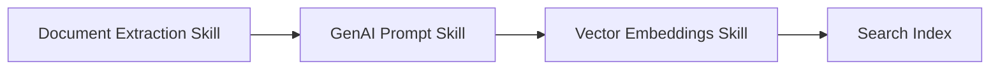
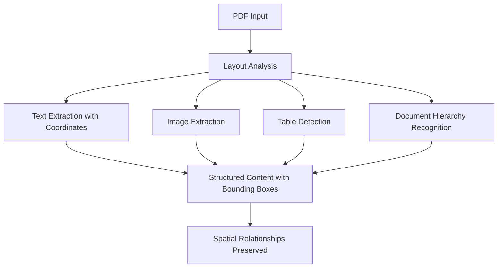
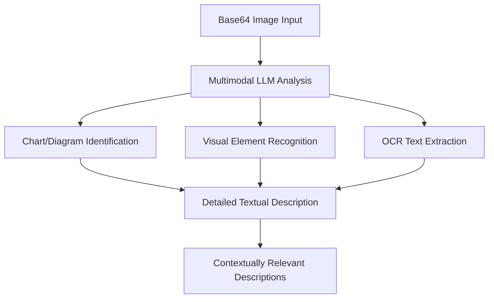
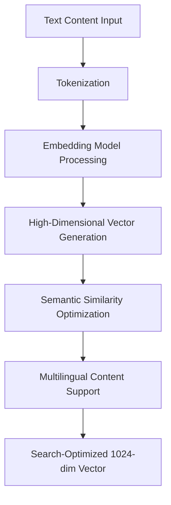
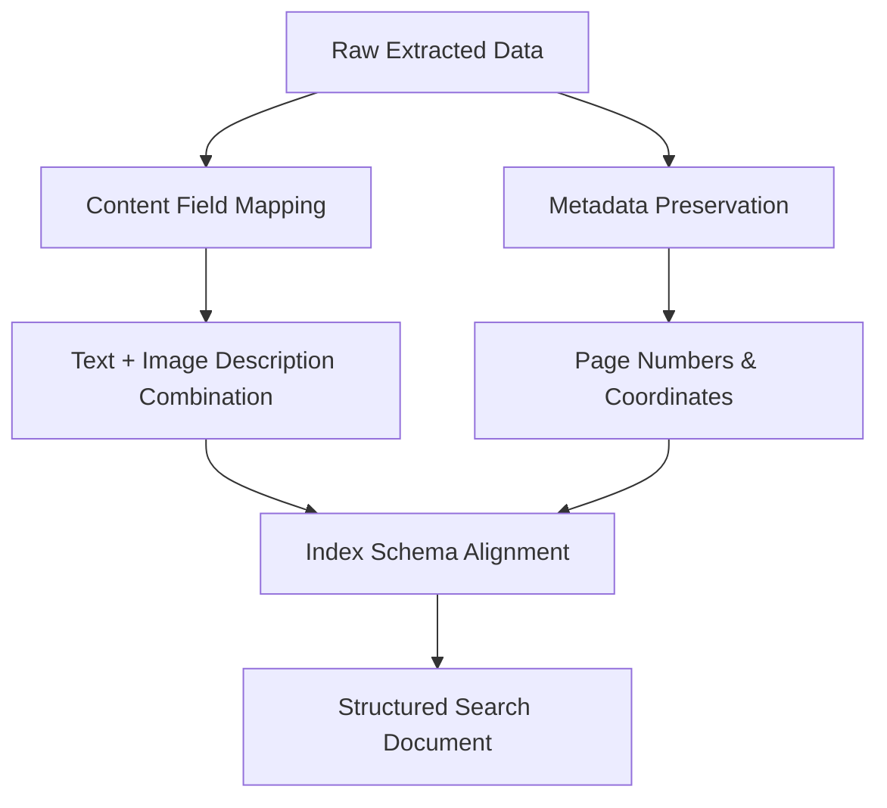
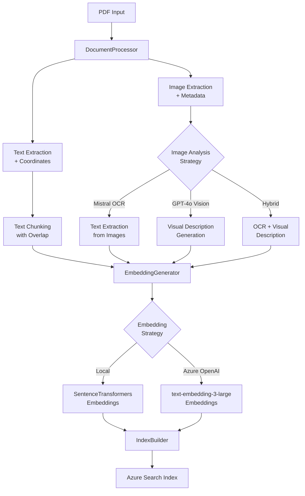
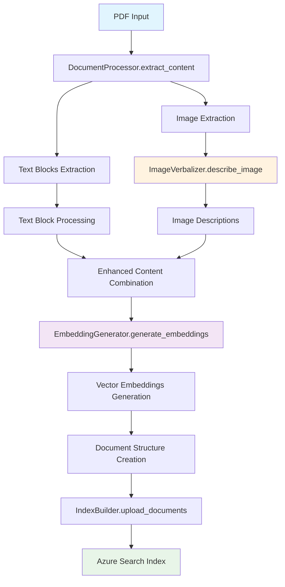

# Azure AI Search Multimodal RAG Demo
[](https://github.com/codespaces/new?hide_repo_select=true&ref=main&repo=984945158&skip_quickstart=true)

## Table of Contents

- [Azure AI Search Multimodal RAG Demo](#azure-ai-search-multimodal-rag-demo)
- [Azure AI Search Portal: Bring your own index and resources](#azure-ai-search-portal-bring-your-own-index-and-resources)
- [Getting Started](#getting-started)
   - [General Requirements](#general-requirements)
- [Environment setup](#environment-setup)
   - [Local development setup (Windows or Linux)](#local-development-setup-windows-or-linux)
   - [Provision resources and deploy working app](#provision-resources-and-deploy-working-app)
   - [Debug app locally](#debug-app-locally)
   - [Bring your own data (supports .pdf only)](#bring-your-own-data-supports-pdf-only)
- [Processing New Documents and Creating Additional Indexes](#processing-new-documents-and-creating-additional-indexes)
   - [Document Placement and Preparation](#document-placement-and-preparation)
      - [1. Document Location Structure](#1-document-location-structure)
      - [2. Document Requirements and Specifications](#2-document-requirements-and-specifications)
      - [3. Pre-Processing Checklist](#3-pre-processing-checklist)
   - [Index Creation Process](#index-creation-process)
      - [1. Creating a New Index for Book Collection](#1-creating-a-new-index-for-book-collection)
      - [2. Understanding Indexer Strategies](#2-understanding-indexer-strategies)
      - [2.1 Deep Dive: How indexer-image-verbal Works](#21-deep-dive-how-indexer-image-verbal-works)
         - [Azure Cognitive Search Skills Pipeline](#azure-cognitive-search-skills-pipeline)
         - [Skill 1: Document Extraction Skill (Document Intelligence Layout)](#skill-1-document-extraction-skill-document-intelligence-layout)
         - [Skill 2: GenAI Prompt Skill (Image Verbalization)](#skill-2-genai-prompt-skill-image-verbalization)
         - [Skill 3: Vector Embeddings Skill](#skill-3-vector-embeddings-skill)
         - [Skill 4: Shaper Skill](#skill-4-shaper-skill)
      - [2.2 Cost-Effective Python Replication Strategy](#22-cost-effective-python-replication-strategy)
         - [Alternative Technology Stack](#alternative-technology-stack)
         - [Implementation Architecture](#implementation-architecture)
         - [Image Verbalization Strategy Comparison](#image-verbalization-strategy-comparison)
   - [Cost Estimation for Document Processing](#cost-estimation-for-document-processing)
      - [Per-Document Processing Costs](#per-document-processing-costs)
      - [Monthly Processing Volume Estimates](#monthly-processing-volume-estimates)
      - [Cost Optimization Strategies](#cost-optimization-strategies)
   - [Troubleshooting Document Processing](#troubleshooting-document-processing)
      - [Common Issues and Solutions](#common-issues-and-solutions)
      - [Processing Performance Optimization](#processing-performance-optimization)
      - [Validation and Quality Assurance](#validation-and-quality-assurance)
      - [Recovery and Rollback Procedures](#recovery-and-rollback-procedures)
- [Moving Services to an Existing Resource Group](#moving-services-to-an-existing-resource-group)
   - [Prerequisites and Planning](#prerequisites-and-planning)
      - [1. Resource Inventory Assessment](#1-resource-inventory-assessment)
      - [2. Move Compatibility Check](#2-move-compatibility-check)
      - [3. Prerequisites Checklist](#3-prerequisites-checklist)
      - [4. Backup and Documentation](#4-backup-and-documentation)
   - [Resource Move Process](#resource-move-process)
      - [Phase 1: Prepare for Move (Estimated time: 15-30 minutes)](#phase-1-prepare-for-move-estimated-time-15-30-minutes)
      - [Phase 2: Execute Resource Move (Estimated time: 30-60 minutes)](#phase-2-execute-resource-move-estimated-time-30-60-minutes)
      - [Phase 3: Recreate Role Assignments (Estimated time: 10-15 minutes)](#phase-3-recreate-role-assignments-estimated-time-10-15-minutes)
   - [Post-Move Configuration Updates](#post-move-configuration-updates)
   - [Validation and Testing](#validation-and-testing)
   - [Troubleshooting Resource Moves](#troubleshooting-resource-moves)
      - [Common Issues and Solutions](#common-issues-and-solutions-1)
      - [Rollback Procedures](#rollback-procedures)
      - [Performance Considerations](#performance-considerations)
- [Azure Services Used for Deployment](#azure-services-used-for-deployment)
   - [Role Mapping for the Application](#role-mapping-for-the-application)
- [End-to-end app diagram](#end-to-end-app-diagram)
- [Troubleshooting](#troubleshooting)


[MIKE EDITS] Welcome to the **Azure AI Search Multimodal RAG Demo**. This repository contains the code for an application designed to showcase [multimodal](https://aka.ms/azs-multimodal) [Retrieval-Augmented Generation (RAG)](https://learn.microsoft.com/azure/search/retrieval-augmented-generation-overview) techniques using [Azure AI Search](https://learn.microsoft.com/azure/search/search-what-is-azure-search). This demo combines AI capabilities to create custom copilots / RAG applications that can query, retrieve, and reason over both text and image data.

With multimodal RAG, you can:

+ Extract relevant information from documents, screenshots, and visuals (like diagrams, charts, workflows, etc.).
+ Preserve and understand the relationships between entities in complex images to enable reasoning over structured content.
+ Generate grounded, accurate responses using Large Language Models (LLMs), integrating insights from both textual and visual modalities.

This demo is intentionally kept lean and simple, providing a hands-on experience with multimodal AI techniques. While not intended for production use, it serves as a powerful starting point for exploring how multimodal RAG can unlock new possibilities in building smarter, more context-aware applications.

Note that currently this sample doesn't have support for table extraction as a structure, but tables are extracted as plain text.

[MIKE NOTE] My plan is to thoroughly understand this app in order to optimize (cost-wise) and prepare for production deployment.

 
**Text citations**  
**Image citations**  

## Azure AI Search Portal: Bring your own index and resources
You can create an index using the AI Search portal's quick wizard for the multimodal scenario. Once the index is successfully created, you can integrate it with the app by running the following steps:

- Run ```az login --use-device-code```
- Run 
   ```pwsh
   scripts/portal-2-app.ps1 `
        -SearchIndexName "my-index" `
        -SearchServiceEndpoint "https://myservice.search.windows.net" `
        -StorageAccountUrl "https://myaccount.blob.core.windows.net" `
        -KnowledgeStoreContainerName "knowledgestore-artifacts" `
        -DataSourcesContainerName "data-sources" `
        -AzureOpenAiEndpoint "https://myopenai.openai.azure.com" `
        -AzureOpenAiDeploymentName "my-deployment" `
        -AzureOpenAiEndpointChatCompletionModelName "gpt-4o"
   ```

   This script will configure the app to use the newly created index.  
   **Assumption**: For app simplicity, ensure 'KnowledgeStoreContainerName' and 'DataSourcesContainerName' must be from same storage account.
- Ensure your Azure Entra ID user object ID has been granted the necessary permissions for all required resources. See [Role Mapping for the Application](#role-mapping-for-the-application) for details.
- Run:
   ```bash
      src/start.sh
   ```

## Getting Started

### General Requirements  
To deploy and run this application, you will need the following:   
  
1. **Azure Account Permissions**  
   - Your Azure account must have sufficient permissions to perform deployments. Specifically, you need:  
     - `Microsoft.Authorization/roleAssignments/write` permissions, such as those granted by the **Role Based Access Control (RBAC) Administrator**, **User Access Administrator**, or **Owner** roles.  
     - **Subscription-level permissions**. Alternatively, if you don't have subscription-level permissions, you must be granted RBAC access for an existing resource group where you'll deploy the application.  
     - `Microsoft.Resources/deployments/write` permissions at the subscription level.  
  
2. **Local Deployment Environment (Optional)**  
   - If a local deployment of the application is required, ensure you have one of the following operating systems set up:  
     - **Windows OS**  
     - **Linux OS**  
---  

## Environment setup

### Local development setup (Windows or Linux)
Install the below tools
- [Python 3.12.7](https://www.python.org/downloads/release/python-3127/)
- [Node.js > v.18](https://nodejs.org/)
- [az cli latest](https://learn.microsoft.com/en-us/cli/azure/install-azure-cli-windows?pivots=winget)
- [azd latest](https://learn.microsoft.com/en-us/azure/developer/azure-developer-cli/install-azd?tabs=winget-windows%2Cbrew-mac%2Cscript-linux&pivots=os-windows)
- [Powershell 7 (Windows and Linux)](https://github.com/powershell/powershell)

### Provision resources and deploy working app
- Run below commands (One time setup per environment)
  - Run ```az login --use-device-code```
  - Run ```azd auth login```
  - Run ```azd env new <YOUR_ENVIRONMENT_NAME>```
  - Run ```azd env set AZURE_PRINCIPAL_ID  <USER_OBJECT_ID>``` (This needs to user's object ID from Azure Entra ID. Alternate you can use command from your local development box ```az ad signed-in-user show --query id -o tsv``` )
  - Run ```azd up```. This command will
    - Provision the azure resources
    - Package the application
    - Injest data into azure search index
    - Deploy the working app to webApp services
  - NOTE: You might encounter provisioning errors on cohere. Please visit troubleshooting section for more details.
  - Once deployment succeeds, you can use the app.
  


NOTE: It may take 5-10 minutes after you see 'SUCCESS' for the application to be fully deployed. If you see a "Python Developer" welcome screen or an error page, then wait a bit and refresh the page.


### Debug app locally
- You need to ***provision all the resources*** before your start to debug app locally
- To launch the app locally, run the below command. The website will open automatically and be served at [localhost:5000](http://localhost:5000).

- **On Windows:**
   ```powershell
   src/start.ps1
   ```

- **On Linux:**
   ```bash
   src/start.sh
   ```

### Bring your own data (supports .pdf only)
- To index your own data,
   - Place pdf's under ```/data``` folder
   - Run ```scripts\prepdocs.ps1```
- You could also use different indexer strategies **["indexer-image-verbal", "self-multimodal-embedding"]** [MIKE NOTE] Want to stray away from "self-multimodal-embedding" b/c 4o-Vision expensive
- To create new index with a different strategy
  - Run ```azd set SEARCH_INDEX_NAME <new-index-name>```
  - **On Windows** Run ```scripts\prepdocs.ps1 -IndexerStrategy indexer-image-verbal ```
  - **On Linux** Run ```scripts\prepdocs.sh indexer-image-verbal ```

---

## Processing New Documents and Creating Additional Indexes

[MIKE ADDED] This section provides comprehensive instructions for adding new documents (such as book PDFs) to your multimodal RAG system and creating specialized indexes for different document collections.

### Document Placement and Preparation

#### 1. Document Location Structure
```
azure-ai-search-multimodal-sample/
├── data/                          # Main document directory
│   ├── books/                     # Organize by document type (optional)
│   │   ├── technical-manual.pdf
│   │   └── research-paper.pdf
│   ├── reports/
│   └── general/
│       └── your-new-book.pdf
```

#### 2. Document Requirements and Specifications

**Supported Formats:**
- **PDF only** (current limitation) [MIKE NOTE] Why? Can we expand?
- **Maximum file size**: 500 MB per document (Azure Document Intelligence limit)
- **Page limit**: 2,000 pages per document (recommended for cost optimization)

**Document Quality Guidelines:**
- **Text clarity**: Ensure text is readable and not heavily distorted
- **Image quality**: Minimum 150 DPI for embedded images/diagrams
- **Language support**: Primarily English, with limited support for other languages
- **Structure**: Documents with clear headings and consistent formatting process better

#### 3. Pre-Processing Checklist

Before placing documents in the `/data` folder:

1. **Verify PDF integrity:**
   ```bash
   # Test if PDF opens without errors
   python -c "
   import fitz  # PyMuPDF
   doc = fitz.open('path/to/your-book.pdf')
   print(f'Pages: {len(doc)}')
   doc.close()
   "
   ```

2. **Check document size and estimated costs:**
   ```bash
   # Get file size and page count
   ls -lh data/your-book.pdf
   python -c "
   import fitz
   doc = fitz.open('data/your-book.pdf')
   pages = len(doc)
   file_size_mb = os.path.getsize('data/your-book.pdf') / (1024*1024)
   estimated_cost = pages * 0.0015  # $1.50 per 1000 pages
   print(f'Pages: {pages}, Size: {file_size_mb:.1f}MB, Est. Processing Cost: ${estimated_cost:.2f}')
   "
   ```

[MIKE NOTE] We should add this into the full optimized solution

### Index Creation Process

#### 1. Creating a New Index for Book Collection

**Step 1: Set Environment Variables**
```bash
# Set a descriptive index name
azd env set SEARCH_INDEX_NAME "book-collection-index"

# Optional: Set custom knowledge agent name
azd env set KNOWLEDGE_AGENT_NAME "book-collection-agent"
```

**Step 2: Place Documents**
```bash
# Create organized structure
mkdir -p data/books
cp /path/to/your-book.pdf data/books/

# Verify placement
ls -la data/books/
```

**Step 3: Execute Document Processing**

**On Windows:**
```powershell
# Basic processing with default strategy
scripts\prepdocs.ps1

# Or with specific indexer strategy for better image processing
scripts\prepdocs.ps1 -IndexerStrategy "indexer-image-verbal"

# For documents with lots of images, use multimodal embedding strategy
scripts\prepdocs.ps1 -IndexerStrategy "self-multimodal-embedding"
```

**On Linux:**
```bash
# Basic processing
scripts/prepdocs.sh

# With specific strategy
scripts/prepdocs.sh indexer-image-verbal

# For image-heavy documents
scripts/prepdocs.sh self-multimodal-embedding
```

#### 2. Understanding Indexer Strategies

**`indexer-image-verbal` (Recommended for most use cases):**
- Uses Azure AI Document Intelligence for layout analysis
- Generates verbal descriptions of images using GPT-4o
- Best for: Technical documents, reports with diagrams, mixed content
- Processing time: ~2-3 minutes per page
- Cost: Higher due to GPT-4o image processing

#### 2.1 Deep Dive: How indexer-image-verbal Works

The `indexer-image-verbal` strategy uses a sophisticated pipeline of Azure Cognitive Search skills to process multimodal documents. Understanding these skills enables cost-effective replication using Python packages.

##### Azure Cognitive Search Skills Pipeline



##### Skill 1: Document Extraction Skill (Document Intelligence Layout)

**Purpose**: Extracts structured content from PDFs with layout analysis

**Process Flow:**


**What it does:**
- Analyzes document layout and structure
- Extracts text with precise bounding box coordinates
- Identifies and extracts embedded images
- Recognizes tables, headings, and document hierarchy
- Preserves spatial relationships between elements

**Cost**: ~$1.50 per 1,000 pages

##### Skill 2: GenAI Prompt Skill (Image Verbalization)

**Purpose**: Converts images to searchable text descriptions

**Process Flow:**


**What it does:**
- Analyzes images using multimodal LLM
- Generates detailed textual descriptions
- Identifies charts, diagrams, and visual elements
- Extracts text visible in images (OCR-like functionality)
- Creates contextually relevant descriptions

**Cost**: ~$0.01-0.05 per image (depending on complexity)

##### Skill 3: Vector Embeddings Skill

**Purpose**: Creates semantic search vectors from text content

**Process Flow:**


**What it does:**
- Converts text to high-dimensional vectors
- Enables semantic similarity search
- Supports multilingual content
- Optimizes for search relevance

**Cost**: ~$0.00013 per 1K tokens

##### Skill 4: Shaper Skill

**Purpose**: Structures and maps data between pipeline stages

**Process Flow:**


**What it does:**
- Maps extracted content to index fields
- Combines text and image descriptions
- Preserves metadata (page numbers, coordinates)
- Structures output for search index

#### 2.2 Cost-Effective Python Replication Strategy

##### Alternative Technology Stack

**Document Processing Alternatives:**
```python
# Instead of Azure Document Intelligence ($1.50/1K pages)
import fitz  # PyMuPDF - Free, excellent for text and layout extraction
import pdfplumber  # Free, specialized for table extraction and precise text positioning  
import pymupdf4llm  # Free, optimized for LLM consumption with markdown output

# Note: unstructured.partition_pdf() provides automatic element detection (text, tables, images)
# but requires their paid API or complex local model setup. The above alternatives provide
# similar functionality with better cost control and simpler deployment.
```

**Image Verbalization Alternatives:**
```python
# Mistral OCR - Cost-effective, excellent for text extraction from images
import openai  # Mistral OCR via Azure AI Foundry endpoint
# Cost: ~$0.003-0.007 per image, excellent for documents with text/tables

# Azure OpenAI Vision - Comprehensive visual understanding  
import openai  # GPT-4o Vision via your existing Azure OpenAI endpoint
# Cost: ~$0.01-0.015 per image vs $0.05 with GenAI Prompt Skill

# Hybrid approach: Use both for optimal results
# Mistral OCR for text extraction + GPT-4o Vision for visual elements
```

**Vector Embedding Alternatives:**
```python
# Local embedding models (free)
from sentence_transformers import SentenceTransformer  # Free local models

# Azure OpenAI Embedding Models (recommended for production)
# text-embedding-3-large: Best quality, 3072 dimensions, $0.00013/1K tokens
# text-embedding-3-small: Good quality, 1536 dimensions, $0.000020/1K tokens
import openai  # Use your existing Azure OpenAI endpoint
```

##### Implementation Architecture



**Pseudo Code Process Flow:**

```python
# DocumentProcessor Module
class DocumentProcessor:
    def extract_content(self, pdf_path):
        doc = fitz.open(pdf_path)
        text_blocks = []
        images = []
        
        for page_num, page in enumerate(doc):
            # Extract text with coordinates
            text_dict = page.get_text("dict")
            for block in text_dict["blocks"]:
                if "lines" in block:  # Text block
                    text_blocks.append({
                        'content': extract_text_from_block(block),
                        'bbox': block["bbox"],
                        'page': page_num
                    })
            
            # Extract images with metadata
            image_list = page.get_images()
            for img_index, img in enumerate(image_list):
                pix = fitz.Pixmap(doc, img[0])
                images.append({
                    'data': pix.tobytes("png"),
                    'bbox': get_image_bbox(page, img),
                    'page': page_num
                })
        
        return {'text_blocks': text_blocks, 'images': images}

# ImageVerbalizer Module  
class ImageVerbalizer:
    def __init__(self, strategy="hybrid"):
        """
        strategy options:
        - 'mistral_ocr': Mistral OCR (cost-effective, excellent for text extraction)
        - 'gpt4o_vision': GPT-4o Vision (comprehensive, best for complex visuals)
        - 'hybrid': Mistral OCR + GPT-4o Vision (best quality, moderate cost)
        """
        self.strategy = strategy
        
        if strategy in ["mistral_ocr", "hybrid"]:
            self.mistral_client = openai.AzureOpenAI(
                base_url="https://your-mistral-endpoint.azure.com",
                api_key="your-mistral-key"
            )
            
        if strategy in ["gpt4o_vision", "hybrid"]:
            self.openai_client = openai.AzureOpenAI(
                base_url="https://your-openai-endpoint.azure.com", 
                api_key="your-openai-key"
            )
    
    def describe_image(self, image_data, context=""):
        if self.strategy == "mistral_ocr":
            return self._mistral_ocr_description(image_data, context)
        elif self.strategy == "gpt4o_vision":
            return self._gpt4o_vision_description(image_data, context)
        elif self.strategy == "hybrid":
            # Use both for comprehensive coverage
            ocr_text = self._mistral_ocr_description(image_data, context)
            visual_desc = self._gpt4o_vision_description(image_data, context)
            return f"OCR Content: {ocr_text}\n\nVisual Description: {visual_desc}"
    
    def _mistral_ocr_description(self, image_data, context):
        base64_image = base64.b64encode(image_data).decode('utf-8')
        response = self.mistral_client.chat.completions.create(
            model="mistral-large-vision",
            messages=[{
                "role": "user",
                "content": [
                    {"type": "text", "text": f"Extract and describe all text content from this image. Context: {context}"},
                    {"type": "image_url", "image_url": {"url": f"data:image/png;base64,{base64_image}"}}
                ]
            }],
            max_tokens=1000
        )
        return response.choices[0].message.content
    
    def _gpt4o_vision_description(self, image_data, context):
        base64_image = base64.b64encode(image_data).decode('utf-8')
        response = self.openai_client.chat.completions.create(
            model="gpt-4o",
            messages=[{
                "role": "user",
                "content": [
                    {"type": "text", "text": f"Describe this image's visual elements, charts, diagrams, and overall content. Focus on searchable details. Context: {context}"},
                    {"type": "image_url", "image_url": {"url": f"data:image/png;base64,{base64_image}"}}
                ]
            }],
            max_tokens=1000
        )
        return response.choices[0].message.content

**Image Verbalization Strategy Comparison:**

| Strategy | Strength | Cost per Image | Best For |
|----------|----------|----------------|----------|
| **Mistral OCR** | Text extraction, cost-effective | $0.003-0.007 | Text-heavy documents, scanned materials, tables |
| **GPT-4o Vision** | Rich descriptions, context understanding | $0.01-0.015 | Visual content, diagrams, comprehensive analysis |
| **Hybrid** | Best quality, comprehensive coverage | $0.013-0.022 | Production systems, mixed content, highest quality |
| **Azure GenAI Prompt Skill** | Integrated pipeline | $0.05 | Azure Skills pipeline only |

**When to Use Each Strategy:**

- **Use Mistral OCR when:** Documents contain lots of scanned text, handwriting, tables, or when budget is primary concern
- **Use GPT-4o Vision when:** Documents contain complex diagrams, charts, or visual elements requiring contextual understanding  
- **Use Hybrid approach when:** Need best of both worlds, budget allows comprehensive processing, or documents mix text-heavy and visual-heavy content

# EmbeddingGenerator Module
class EmbeddingGenerator:
    def __init__(self, strategy="azure_openai"):
        if strategy == "local":
            self.model = SentenceTransformer('all-MiniLM-L6-v2')
        else:
            self.client = openai.AzureOpenAI(...)
    
    def generate_embeddings(self, texts):
        if self.strategy == "local":
            return self.model.encode(texts).tolist()
        else:
            response = self.client.embeddings.create(
                model="text-embedding-3-large",
                input=texts
            )
            return [item.embedding for item in response.data]

# Main Orchestrator
class MultimodalIndexer:
    def process_pdf(self, pdf_path):
        # Step 1: Extract content
        content = self.document_processor.extract_content(pdf_path)
        
        # Step 2: Process images
        enhanced_content = []
        for text_block in content['text_blocks']:
            enhanced_content.append(text_block)
        
        for image in content['images']:
            description = self.image_verbalizer.describe_image(
                image['data'], 
                context=f"Image from page {image['page']}"
            )
            enhanced_content.append({
                'content': description,
                'bbox': image['bbox'],
                'page': image['page'],
                'type': 'image_description'
            })
        
        # Step 3: Generate embeddings
        texts = [item['content'] for item in enhanced_content]
        embeddings = self.embedding_generator.generate_embeddings(texts)
        
        # Step 4: Upload to search index
        documents = []
        for i, item in enumerate(enhanced_content):
            documents.append({
                'id': f"{pdf_path}_{item['page']}_{i}",
                'content': item['content'],
                'embedding': embeddings[i],
                'page': item['page'],
                'bbox': item['bbox'],
                'source': pdf_path
            })
        
        return self.index_builder.upload_documents(documents)

**Complete Pipeline Flow:**


### Cost Estimation for Document Processing

#### Per-Document Processing Costs

**Small Document (10-20 pages):**
- Document Intelligence: $0.015 - $0.030
- GPT-4o Image Processing: $0.050 - $0.100 (if using image-verbal)
- Text Embeddings: $0.020 - $0.040
- Image Embeddings: $0.030 - $0.060 (if using multimodal)
- **Total: $0.115 - $0.230 per document**

**Medium Document (50-100 pages):**
- Document Intelligence: $0.075 - $0.150
- GPT-4o Image Processing: $0.250 - $0.500
- Text Embeddings: $0.100 - $0.200
- Image Embeddings: $0.150 - $0.300
- **Total: $0.575 - $1.150 per document**

**Large Document (200+ pages, like a book):**
- Document Intelligence: $0.300 - $0.600
- GPT-4o Image Processing: $1.000 - $2.000
- Text Embeddings: $0.400 - $0.800
- Image Embeddings: $0.600 - $1.200
- **Total: $2.300 - $4.600 per document**

#### Monthly Processing Volume Estimates

**Research Team (20 documents/month):**
- Average cost per document: $0.50
- Monthly processing cost: $10
- Annual cost: $120

**Enterprise Department (100 documents/month):**
- Average cost per document: $0.75
- Monthly processing cost: $75
- Annual cost: $900

**Large Organization (500 documents/month):**
- Average cost per document: $1.00
- Monthly processing cost: $500
- Annual cost: $6,000

#### Cost Optimization Strategies

1. **Batch Processing**: Process multiple documents together to reduce overhead
2. **Strategy Selection**: Use simpler strategies for text-heavy documents
3. **Document Preprocessing**: Remove unnecessary pages before processing
4. **Incremental Updates**: Only reprocess changed documents

### Troubleshooting Document Processing

#### Common Issues and Solutions

**1. "Document Intelligence Analysis Failed"**
```bash
# Check document integrity
python -c "
import fitz
try:
    doc = fitz.open('data/your-book.pdf')
    print(f'Document OK: {len(doc)} pages')
except:
    print('Document corrupted or unreadable')
"

# Solution: Re-download or repair PDF
```

**2. "Embedding Generation Timeout"**
```bash
# Check if document is too large
ls -lh data/your-book.pdf

# Solution: Split large documents or increase timeout
# Edit src/backend/processfile.py, line ~380:
# self.text_model = EmbeddingsClient(..., timeout=120)  # Increase timeout
```

**3. "Index Upload Failed - Field Validation Error"**
```bash
# Check for special characters in document content
grep -P '[^\x00-\x7F]' data/your-book.pdf

# Solution: Clean document or update field definitions
```

**4. "Insufficient Azure Credits/Quota"**
```bash
# Check current usage
az consumption usage list --start-date $(date -d '1 month ago' +%Y-%m-%d)

# Solution: Monitor and set up billing alerts
az consumption budget create --resource-group <rg-name> --budget-name "DocumentProcessing" --amount 100
```

#### Processing Performance Optimization

**1. Parallel Processing Configuration:**
```python
# Edit src/backend/processfile.py for concurrent processing
import asyncio
import aiofiles

class ProcessFile:
    def __init__(self, ...):
        self.max_concurrent_docs = 3  # Adjust based on quota limits
        self.semaphore = asyncio.Semaphore(self.max_concurrent_docs)
```

**2. Memory Optimization for Large Documents:**
```python
# Process documents in smaller chunks
CHUNK_SIZE = 50  # Process 50 pages at a time
for i in range(0, total_pages, CHUNK_SIZE):
    chunk_pages = pages[i:i+CHUNK_SIZE]
    await self._process_page_chunk(chunk_pages)
```

**3. Network Optimization:**
```bash
# Increase timeout for slow connections
export AZURE_CLIENT_TIMEOUT=300
export AZURE_RETRY_ATTEMPTS=5
```

#### Validation and Quality Assurance

**1. Post-Processing Validation:**
```bash
# Verify index was created successfully
az search index show --index-name "book-collection-index" --service-name <search-service>

# Check document count
az search index statistics --index-name "book-collection-index" --service-name <search-service>
```

**2. Content Quality Verification:**
```python
# Test search functionality with sample queries
import requests

test_query = {
    "search": "chapter 1 introduction",
    "queryType": "semantic",
    "semanticConfiguration": "semanticconfig",
    "queryLanguage": "en-us",
    "count": 5
}

response = requests.post(f"{search_endpoint}/indexes/{index_name}/docs/search", 
                        json=test_query, headers=headers)
print(f"Search results: {len(response.json()['value'])} documents found")
```

**3. Citation Functionality Test:**
```python
# Verify visual citations are working
test_citations = response.json()['value'][0].get('locationMetadata')
if test_citations and 'boundingPolygons' in test_citations:
    print("✅ Visual citations properly configured")
else:
    print("❌ Visual citations missing - check processing strategy")
```

#### Recovery and Rollback Procedures

**1. Index Recovery:**
```bash
# Backup current index definition
az search index show --index-name "book-collection-index" > backup-index-schema.json

# Delete corrupted index
az search index delete --index-name "book-collection-index" --yes

# Recreate from backup
az search index create --index-definition backup-index-schema.json
```

**2. Document Reprocessing:**
```bash
# Reprocess specific failed documents
scripts/prepdocs.ps1 -DocumentPath "data/books/specific-book.pdf" -ForceReprocess $true

# Clean and restart full processing
rm -rf data/.processing_cache/
scripts/prepdocs.ps1 -IndexerStrategy "indexer-image-verbal"
```

**3. Cost Management Recovery:**
```bash
# Set emergency budget alerts
az consumption budget create \
    --budget-name "EmergencyStop" \
    --amount 50 \
    --time-grain "Monthly" \
    --notifications '[{
        "enabled": true,
        "operator": "GreaterThan",
        "threshold": 80,
        "contactEmails": ["admin@company.com"]
    }]'
```

---

## Moving Services to an Existing Resource Group

This section provides detailed instructions for moving all Azure services created by the multimodal RAG application to an existing resource group. This is commonly needed for organizational consolidation or compliance requirements.

### Prerequisites and Planning

#### 1. Resource Inventory Assessment

First, identify all resources created by the deployment:

```bash
# List all resources in the current resource group
az resource list --resource-group <current-rg-name> --output table

# Get detailed information about each resource
az resource list --resource-group <current-rg-name> --query '[].{Name:name, Type:type, Location:location}' --output table
```

**Typical Resources Created:**
- Azure AI Search service (`Microsoft.Search/searchServices`)
- Cognitive Services account (`Microsoft.CognitiveServices/accounts`)
- Storage account (`Microsoft.Storage/storageAccounts`)
- App Service plan (`Microsoft.Web/serverfarms`)
- App Service (`Microsoft.Web/sites`)
- Azure Machine Learning workspace (`Microsoft.MachineLearningServices/workspaces`) - if using Prompt Flow
- Role assignments (`Microsoft.Authorization/roleAssignments`)

#### 2. Move Compatibility Check

Not all resources can be moved between resource groups. Check compatibility:

```bash
# Check if resources support move operations
az resource list --resource-group <current-rg-name> --query '[].{Name:name, Type:type}' | \
while read line; do
    echo "Checking move support for: $line"
done
```

**Resources That CAN Be Moved:**
- ✅ Azure AI Search service
- ✅ Cognitive Services account
- ✅ Storage account
- ✅ App Service and App Service Plan
- ✅ Azure Machine Learning workspace

**Resources That CANNOT Be Moved:**
- ❌ Role assignments (must be recreated)
- ❌ Some Cohere serverless deployments (region-dependent)

#### 3. Prerequisites Checklist

Before starting the move:

**Required Permissions:**
```bash
# Verify you have the necessary permissions
az role assignment list --assignee $(az ad signed-in-user show --query id -o tsv) \
    --query '[?roleDefinitionName==`Owner` || roleDefinitionName==`Contributor`]' \
    --output table
```

**Required Roles:**
- **Contributor** or **Owner** on both source and destination resource groups
- **User Access Administrator** for recreating role assignments

**Pre-Move Validation:**
```bash
# Verify target resource group exists
az group show --name <target-rg-name>

# Check target resource group location compatibility
az group show --name <target-rg-name> --query location -o tsv
az group show --name <current-rg-name> --query location -o tsv
```

#### 4. Backup and Documentation

**Environment Backup:**
```bash
# Export current azd environment
azd env get-values > backup-env-$(date +%Y%m%d).json

# Backup current configuration
cp ~/.azure/<environment-name>/.env backup-env-file-$(date +%Y%m%d).env

# Document current resource configuration
az resource list --resource-group <current-rg-name> --output json > backup-resources-$(date +%Y%m%d).json
```

### Resource Move Process

#### Phase 1: Prepare for Move (Estimated time: 15-30 minutes)

**1. Stop Application Services:**
```bash
# Stop the App Service to prevent connections during move
az webapp stop --name <app-name> --resource-group <current-rg-name>

# Verify app is stopped
az webapp show --name <app-name> --resource-group <current-rg-name> --query state
```

**2. Create Resource Move Validation:**
```bash
# Get resource IDs for move validation
SEARCH_SERVICE_ID=$(az search service show --name <search-service-name> --resource-group <current-rg-name> --query id -o tsv)
STORAGE_ACCOUNT_ID=$(az storage account show --name <storage-account-name> --resource-group <current-rg-name> --query id -o tsv)
COGNITIVE_SERVICES_ID=$(az cognitiveservices account show --name <cognitive-services-name> --resource-group <current-rg-name> --query id -o tsv)
APP_SERVICE_ID=$(az webapp show --name <app-name> --resource-group <current-rg-name> --query id -o tsv)
APP_SERVICE_PLAN_ID=$(az appservice plan show --name <app-service-plan-name> --resource-group <current-rg-name> --query id -o tsv)

# Create array of resource IDs
RESOURCE_IDS=($SEARCH_SERVICE_ID $STORAGE_ACCOUNT_ID $COGNITIVE_SERVICES_ID $APP_SERVICE_ID $APP_SERVICE_PLAN_ID)
```

**3. Validate Move Operation:**
```bash
# Create validation payload
cat > move-validation.json << EOF
{
  "resources": [
    "$SEARCH_SERVICE_ID",
    "$STORAGE_ACCOUNT_ID", 
    "$COGNITIVE_SERVICES_ID",
    "$APP_SERVICE_ID",
    "$APP_SERVICE_PLAN_ID"
  ],
  "targetResourceGroup": "/subscriptions/$(az account show --query id -o tsv)/resourceGroups/<target-rg-name>"
}
EOF

# Validate the move
az rest --method post \
    --url "https://management.azure.com/subscriptions/$(az account show --query id -o tsv)/resourceGroups/<current-rg-name>/validateMoveResources?api-version=2021-04-01" \
    --body @move-validation.json
```

#### Phase 2: Execute Resource Move (Estimated time: 30-60 minutes)

**1. Move Resources (Sequential Approach):**

```bash
# Move App Service Plan first (dependency for App Service)
echo "Moving App Service Plan..."
az resource move --destination-group <target-rg-name> --ids $APP_SERVICE_PLAN_ID

# Wait for completion and verify
az resource show --ids $APP_SERVICE_PLAN_ID --query resourceGroup

# Move App Service
echo "Moving App Service..."
az resource move --destination-group <target-rg-name> --ids $APP_SERVICE_ID

# Move Storage Account
echo "Moving Storage Account..."
az resource move --destination-group <target-rg-name> --ids $STORAGE_ACCOUNT_ID

# Move Cognitive Services
echo "Moving Cognitive Services..."
az resource move --destination-group <target-rg-name> --ids $COGNITIVE_SERVICES_ID

# Move AI Search Service
echo "Moving AI Search Service..."
az resource move --destination-group <target-rg-name> --ids $SEARCH_SERVICE_ID
```

**2. Monitor Move Progress:**
```bash
# Check move operation status
az resource list --resource-group <target-rg-name> --output table

# Verify resources are no longer in source group
az resource list --resource-group <current-rg-name> --output table
```

**3. Move Azure ML Workspace (if applicable):**
```bash
# If using Prompt Flow, move ML workspace
ML_WORKSPACE_ID=$(az ml workspace show --name <ml-workspace-name> --resource-group <current-rg-name> --query id -o tsv)
az resource move --destination-group <target-rg-name> --ids $ML_WORKSPACE_ID
```

#### Phase 3: Recreate Role Assignments (Estimated time: 10-15 minutes)

Role assignments cannot be moved and must be recreated:

**1. Document Current Role Assignments:**
```bash
# List current role assignments
az role assignment list --resource-group <current-rg-name> --output table > role-assignments-backup.txt
```

**2. Recreate Role Assignments in Target Resource Group:**
```bash
# Get your user object ID
USER_OBJECT_ID=$(az ad signed-in-user show --query id -o tsv)

# Storage Blob Data Contributor
az role assignment create \
    --assignee $USER_OBJECT_ID \
    --role "ba92f5b4-2d11-453d-a403-e96b0029c9fe" \
    --resource-group <target-rg-name>

# Cognitive Services User  
az role assignment create \
    --assignee $USER_OBJECT_ID \
    --role "a97b65f3-24c7-4388-baec-2e87135dc908" \
    --resource-group <target-rg-name>

# Search Index Data Contributor
az role assignment create \
    --assignee $USER_OBJECT_ID \
    --role "8ebe5a00-799e-43f5-93ac-243d3dce84a7" \
    --resource-group <target-rg-name>

# Search Service Contributor
az role assignment create \
    --assignee $USER_OBJECT_ID \
    --role "7ca78c08-252a-4471-8644-bb5ff32d4ba0" \
    --resource-group <target-rg-name>

# Azure AI Developer
az role assignment create \
    --assignee $USER_OBJECT_ID \
    --role "64702f94-c441-49e6-a78b-ef80e0188fee" \
    --resource-group <target-rg-name>
```

### Post-Move Configuration Updates

#### 1. Update Azure Developer CLI Environment

**Update azd environment configuration:**
```bash
# Update the azd environment to point to new resource group
azd env set AZURE_RESOURCE_GROUP <target-rg-name>

# Refresh azd environment
azd env refresh

# Verify configuration
azd env get-values
```

#### 2. Update Application Configuration

**Update App Service configuration if needed:**
```bash
# Get current app settings
az webapp config appsettings list --name <app-name> --resource-group <target-rg-name>

# Update any resource group references in app settings (if any)
# Most settings should remain valid as they reference resource names, not resource groups
```

#### 3. Update Local Environment Files

**Update local .env files:**
```bash
# Update your local environment file if it contains resource group references
sed -i 's/<current-rg-name>/<target-rg-name>/g' ~/.azure/<environment-name>/.env

# Verify the changes
cat ~/.azure/<environment-name>/.env | grep RESOURCE_GROUP
```

#### 4. Clean Up Source Resource Group

**After successful move and testing:**
```bash
# List remaining resources in source group
az resource list --resource-group <current-rg-name> --output table

# If empty and no longer needed, delete the source resource group
az group delete --name <current-rg-name> --yes --no-wait
```

### Validation and Testing

#### 1. Service Connectivity Validation

**Test each service individually:**
```bash
# Test Storage Account
az storage container list --account-name <storage-account-name> --auth-mode login

# Test AI Search Service  
az search service show --name <search-service-name> --resource-group <target-rg-name>

# Test Cognitive Services
az cognitiveservices account show --name <cognitive-services-name> --resource-group <target-rg-name>
```

#### 2. Application Functionality Testing

**Start and test the application:**
```bash
# Start the App Service
az webapp start --name <app-name> --resource-group <target-rg-name>

# Test the application locally
src/start.sh  # or src/start.ps1 on Windows

# Verify the app opens at http://localhost:5000
```

**Test Core Functionality:**
1. **Search Functionality**: Submit a test query
2. **Citation Display**: Click on citations to verify PDF highlighting
3. **Document Upload**: Test processing a new document (if applicable)
4. **Index Access**: Verify search indexes are accessible

#### 3. Search Index Validation

**Verify search indexes are accessible:**
```bash
# List indexes
az search index list --service-name <search-service-name> --resource-group <target-rg-name>

# Test search query
az search index search --service-name <search-service-name> \
    --index-name <index-name> \
    --search-text "test query" \
    --resource-group <target-rg-name>
```

#### 4. Data Integrity Check

**Verify data integrity:**
```bash
# Check blob storage containers
az storage container list --account-name <storage-account-name> --auth-mode login

# Verify document count in search index
az search index statistics --service-name <search-service-name> \
    --index-name <index-name> \
    --resource-group <target-rg-name>
```

### Troubleshooting Resource Moves

#### Common Issues and Solutions

**1. "Cannot move resource due to dependencies"**
```bash
# Solution: Move dependencies first
# App Service Plan must be moved before App Service
# Check for hidden dependencies:
az resource show --ids <resource-id> --query dependencies
```

**2. "Access denied during move operation"**
```bash
# Check your permissions
az role assignment list --assignee $(az ad signed-in-user show --query id -o tsv) \
    --resource-group <current-rg-name>

# Ensure you have Contributor or Owner role
az role assignment create \
    --assignee $(az ad signed-in-user show --query id -o tsv) \
    --role "Contributor" \
    --resource-group <current-rg-name>
```

**3. "Resource group location mismatch"**
```bash
# Check if target resource group is in the same region
az group show --name <target-rg-name> --query location
az group show --name <current-rg-name> --query location

# Some resources cannot move between regions
# Solution: Create new resources in target region if needed
```

**4. "App Service not responding after move"**
```bash
# Restart the App Service
az webapp restart --name <app-name> --resource-group <target-rg-name>

# Check app service logs
az webapp log tail --name <app-name> --resource-group <target-rg-name>

# Verify app service plan is in the same resource group
az webapp show --name <app-name> --resource-group <target-rg-name> --query serverFarmId
```

**5. "Search index not accessible"**
```bash
# Verify search service is running
az search service show --name <search-service-name> --resource-group <target-rg-name> --query status

# Check if indexes were preserved
az search index list --service-name <search-service-name> --resource-group <target-rg-name>

# Verify role assignments for search service
az role assignment list --scope "/subscriptions/$(az account show --query id -o tsv)/resourceGroups/<target-rg-name>"
```

**6. "Authentication errors after move"**
```bash
# Clear Azure CLI cache
az account clear
az login

# Refresh azd authentication
azd auth login

# Verify service principal permissions
az ad sp list --display-name <app-name> --query '[].appId' -o tsv
```

#### Rollback Procedures

**If the move fails and you need to rollback:**

**1. Move Resources Back:**
```bash
# Get resource IDs from target group
FAILED_RESOURCE_IDS=$(az resource list --resource-group <target-rg-name> --query '[].id' -o tsv)

# Move back to source group
for resource_id in $FAILED_RESOURCE_IDS; do
    az resource move --destination-group <current-rg-name> --ids $resource_id
done
```

**2. Restore Environment Configuration:**
```bash
# Restore from backup
cp backup-env-file-$(date +%Y%m%d).env ~/.azure/<environment-name>/.env

# Reset azd environment
azd env set AZURE_RESOURCE_GROUP <current-rg-name>
```

**3. Verify Application Functionality:**
```bash
# Restart services
az webapp start --name <app-name> --resource-group <current-rg-name>

# Test application
src/start.sh
```

#### Performance Considerations

**Move Operation Timing:**
- **Small deployment** (basic services): 30-45 minutes
- **Large deployment** (with ML workspace): 60-90 minutes
- **Complex deployment** (multiple indexes): 90-120 minutes

**Downtime Minimization:**
1. Schedule moves during maintenance windows
2. Consider blue-green deployment for critical applications
3. Use staging slots for App Service to test configuration

**Post-Move Optimization:**
```bash
# Clear any cached connections
az webapp restart --name <app-name> --resource-group <target-rg-name>

# Verify performance metrics
az monitor metrics list --resource <app-service-resource-id> \
    --metric "Http2xx" --interval PT1M
```

## Azure Services Used for Deployment  
The following Azure services are used as part of this deployment. Ensure you verify their billing and pricing details as part of the setup:  
  
1. **Azure AI Search**  
   - Service used for search functionalities within the application. Review [pricing](https://azure.microsoft.com/pricing/details/search/).
  
2. **Azure AI Document Intelligence**  
   - Service used for processing and extracting information from documents. Review [pricing](https://azure.microsoft.com/pricing/details/ai-document-intelligence/). 
  
3. Your provided:
   - **LLM Deployment**: For running the large language model (LLM) for verbalization and used by the RAG orchestrator. 
   - **Embedding Model Deployment**: Used for creating embeddings for vector search and other tasks.   
   - Ensure you check the pricing for both LLM and embedding deployments.
   - This sample currently supports gpt-4o, (AOAI) text-embedding-large, cohere-serverless-v3  
  
4. **Azure Blob Storage Account**  
   - Used to store extracted images and other data. Verify the pricing for storage and associated operations. Review [pricing](https://azure.microsoft.com/pricing/details/storage/blobs/).
  
5. **Azure App Service**  
   - Used to host and run the application in the cloud. Review [pricing](https://azure.microsoft.com/pricing/details/app-service/windows/). 

### Role Mapping for the Application  
The following table maps the roles used by the application to their respective functions:  
  
| **Role ID**                              | **Built-in Role Name**                  | **Purpose**                                                                                     |  
|------------------------------------------|------------------------------------------|-------------------------------------------------------------------------------------------------|  
| `5e0bd9bd-7b93-4f28-af87-19fc36ad61bd`   | **Cognitive Services OpenAI User**       | Read-only access to models, files, and deployments in an Azure OpenAI resource. Allows running completion/embedding/image-generation calls. |  
| `a97b65f3-24c7-4388-baec-2e87135dc908`   | **Cognitive Services User**              | Provides read access to an Azure Cognitive Services resource and the ability to list its access keys. (No write or manage permissions.) |  
| `ba92f5b4-2d11-453d-a403-e96b0029c9fe`   | **Storage Blob Data Contributor**        | Allows read, upload, modify, and delete operations on blobs and containers within an Azure Storage account (data-plane only). |  
| `7ca78c08-252a-4471-8644-bb5ff32d4ba0`   | **Search Service Contributor**           | Enables management of the Azure Cognitive Search service (e.g., create, scale, delete). Does not provide access to index data itself. |  
| `8ebe5a00-799e-43f5-93ac-243d3dce84a7`   | **Search Index Data Contributor**        | Provides full create, read, update, and delete access to all
| `64702f94-c441-49e6-a78b-ef80e0188fee`   | **Azure AI Developer**                   | Provides full create, read access to AI foundry projects.

## End-to-end app diagram


## Troubleshooting
- What is the region availability for Azure OpenAI service?  
  Please visit [available regions](https://learn.microsoft.com/azure/ai-services/openai/concepts/models?tabs=global-standard%2Cstandard-chat-completions#global-standard-model-availability)
- What is the region availability for Cohere Serverless?    
  Cohere serverless is supported only in [5 regions](https://learn.microsoft.com/azure/ai-foundry/how-to/deploy-models-serverless-availability#cohere-models)
- Deployment fails for 'Cohere' in marketplace subscription 
  - Ensure your subscription is supported or enabled for Marketplace deployment [Learn more](https://learn.microsoft.com/en-us/azure/ai-foundry/how-to/deploy-models-serverless?tabs=azure-ai-studio#prerequisites)
  - There is a known issue of conflict operation between Marketplace subscription and endpoint deployment. **Rerun deployment** to fix it

