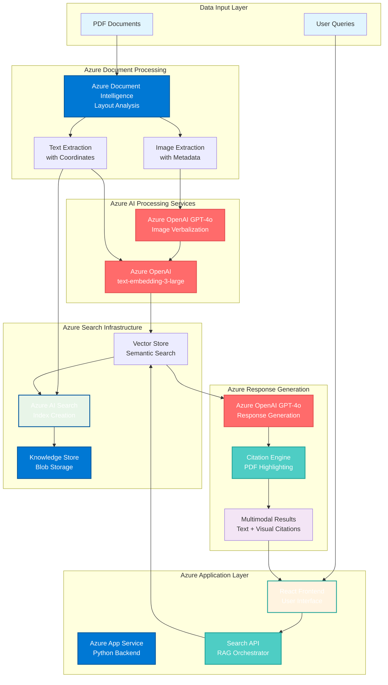
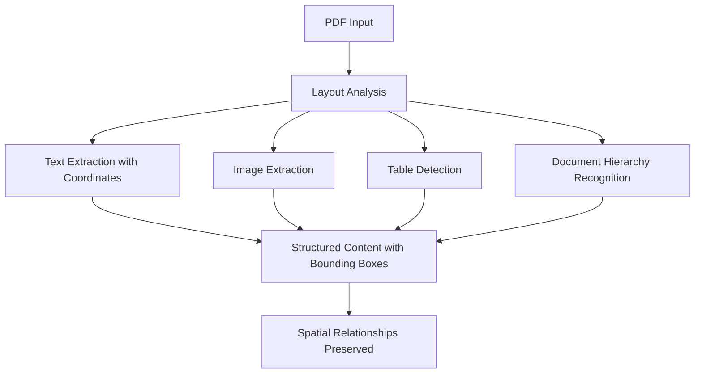
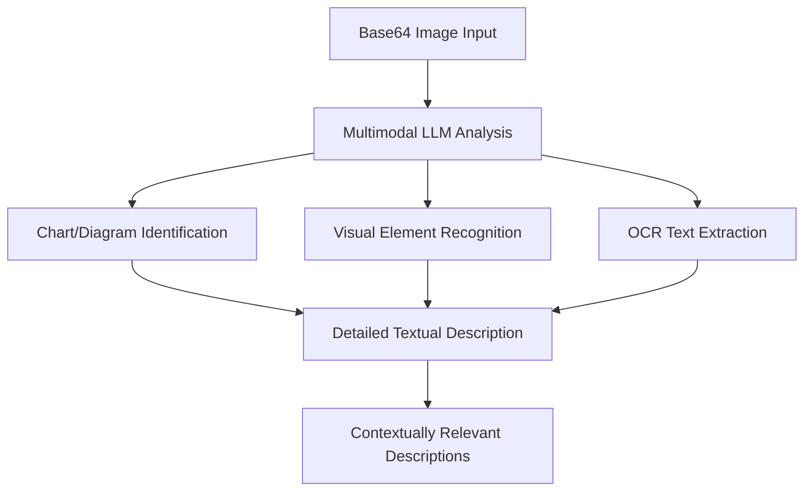
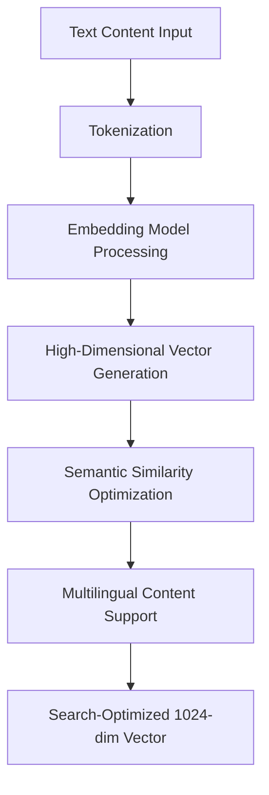
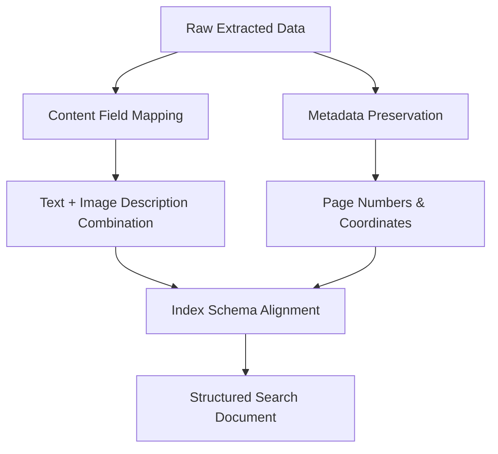
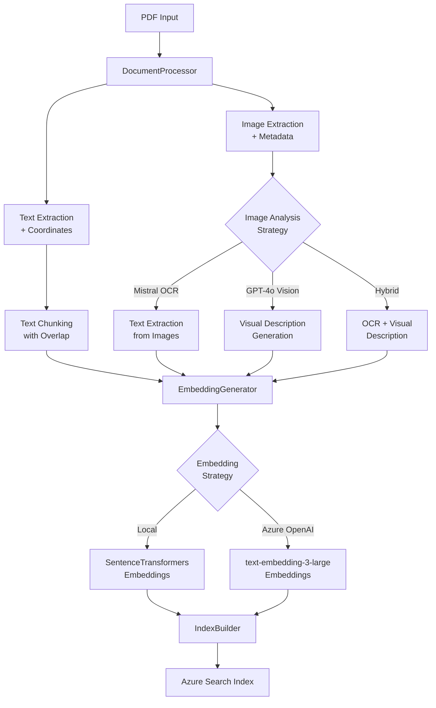
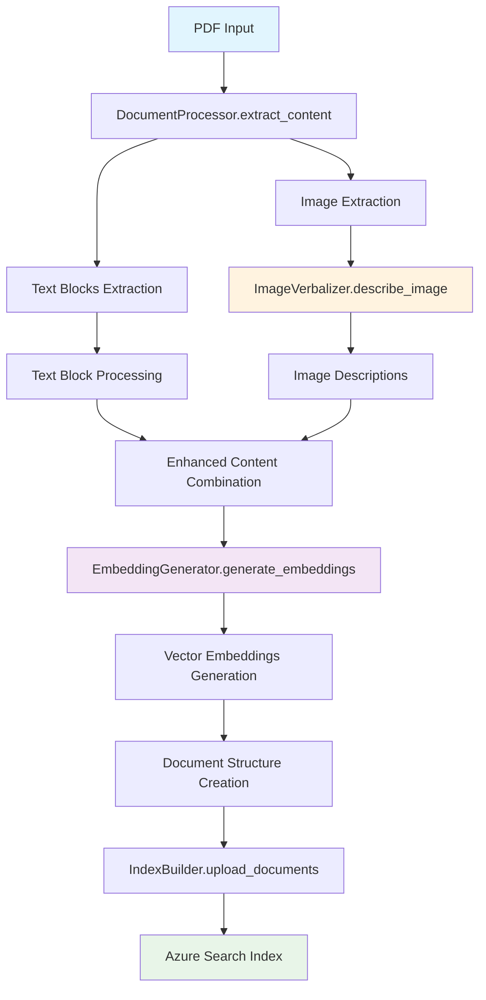
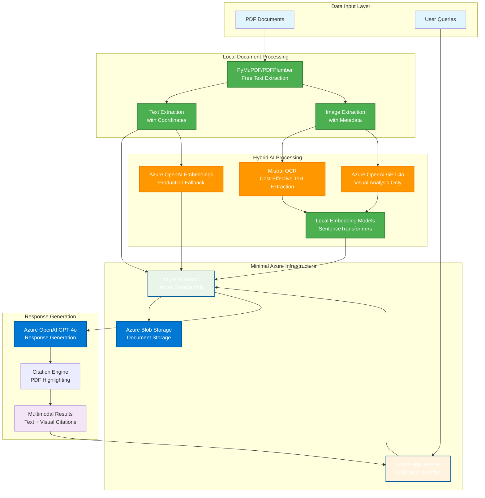

# Azure AI Search Multimodal RAG Demo

## Table of Contents

- [Azure AI Search Multimodal RAG Demo](#azure-ai-search-multimodal-rag-demo)
- [Azure AI Search Portal: Bring your own index and resources](#azure-ai-search-portal-bring-your-own-index-and-resources)
- [Getting Started](#getting-started)
   - [General Requirements](#general-requirements)
- [Environment setup](#environment-setup)
   - [Local development setup (Windows or Linux)](#local-development-setup-windows-or-linux)
   - [Provision resources and deploy working app](#provision-resources-and-deploy-working-app)
   - [Debug app locally](#debug-app-locally)
   - [Bring your own data (supports .pdf only)](#bring-your-own-data-supports-pdf-only)
- [Processing New Documents and Creating Additional Indexes](#processing-new-documents-and-creating-additional-indexes)
   - [Document Placement and Preparation](#document-placement-and-preparation)
      - [1. Document Location Structure](#1-document-location-structure)
      - [2. Document Requirements and Specifications](#2-document-requirements-and-specifications)
      - [3. Pre-Processing Checklist](#3-pre-processing-checklist)
   - [Index Creation Process](#index-creation-process)
      - [1. Creating a New Index for Book Collection](#1-creating-a-new-index-for-book-collection)
      - [2. Understanding Indexer Strategies](#2-understanding-indexer-strategies)
      - [2.1 Deep Dive: How indexer-image-verbal Works](#21-deep-dive-how-indexer-image-verbal-works)
         - [Azure Cognitive Search Skills Pipeline](#azure-cognitive-search-skills-pipeline)
         - [Skill 1: Document Extraction Skill (Document Intelligence Layout)](#skill-1-document-extraction-skill-document-intelligence-layout)
         - [Skill 2: GenAI Prompt Skill (Image Verbalization)](#skill-2-genai-prompt-skill-image-verbalization)
         - [Skill 3: Vector Embeddings Skill](#skill-3-vector-embeddings-skill)
         - [Skill 4: Shaper Skill](#skill-4-shaper-skill)
      - [2.2 Cost-Effective Python Replication Strategy](#22-cost-effective-python-replication-strategy)
         - [Alternative Technology Stack](#alternative-technology-stack)
         - [Implementation Architecture](#implementation-architecture)
         - [Image Verbalization Strategy Comparison](#image-verbalization-strategy-comparison)
   - [Cost Estimation for Document Processing](#cost-estimation-for-document-processing)
      - [Per-Document Processing Costs](#per-document-processing-costs)
      - [Monthly Processing Volume Estimates](#monthly-processing-volume-estimates)
      - [Cost Optimization Strategies](#cost-optimization-strategies)
   - [Troubleshooting Document Processing](#troubleshooting-document-processing)
      - [Common Issues and Solutions](#common-issues-and-solutions)
      - [Processing Performance Optimization](#processing-performance-optimization)
      - [Validation and Quality Assurance](#validation-and-quality-assurance)
      - [Recovery and Rollback Procedures](#recovery-and-rollback-procedures)
- [Moving Services to an Existing Resource Group](#moving-services-to-an-existing-resource-group)
   - [Prerequisites and Planning](#prerequisites-and-planning)
      - [1. Resource Inventory Assessment](#1-resource-inventory-assessment)
      - [2. Move Compatibility Check](#2-move-compatibility-check)
      - [3. Prerequisites Checklist](#3-prerequisites-checklist)
      - [4. Backup and Documentation](#4-backup-and-documentation)
   - [Resource Move Process](#resource-move-process)
      - [Phase 1: Prepare for Move (Estimated time: 15-30 minutes)](#phase-1-prepare-for-move-estimated-time-15-30-minutes)
      - [Phase 2: Execute Resource Move (Estimated time: 30-60 minutes)](#phase-2-execute-resource-move-estimated-time-30-60-minutes)
      - [Phase 3: Recreate Role Assignments (Estimated time: 10-15 minutes)](#phase-3-recreate-role-assignments-estimated-time-10-15-minutes)
   - [Post-Move Configuration Updates](#post-move-configuration-updates)
   - [Validation and Testing](#validation-and-testing)
   - [Troubleshooting Resource Moves](#troubleshooting-resource-moves)
      - [Common Issues and Solutions](#common-issues-and-solutions-1)
      - [Rollback Procedures](#rollback-procedures)
      - [Performance Considerations](#performance-considerations)
- [Azure Services Used for Deployment](#azure-services-used-for-deployment)
   - [Role Mapping for the Application](#role-mapping-for-the-application)
- [End-to-end app diagram](#end-to-end-app-diagram)
- [Troubleshooting](#troubleshooting)


[MIKE EDITS] Welcome to the **Azure AI Search Multimodal RAG Demo**. This repository contains the code for an application designed to showcase [multimodal](https://aka.ms/azs-multimodal) [Retrieval-Augmented Generation (RAG)](https://learn.microsoft.com/azure/search/retrieval-augmented-generation-overview) techniques using [Azure AI Search](https://learn.microsoft.com/azure/search/search-what-is-azure-search). This demo combines AI capabilities to create custom copilots / RAG applications that can query, retrieve, and reason over both text and image data.

With multimodal RAG, you can:

+ Extract relevant information from documents, screenshots, and visuals (like diagrams, charts, workflows, etc.).
+ Preserve and understand the relationships between entities in complex images to enable reasoning over structured content.
+ Generate grounded, accurate responses using Large Language Models (LLMs), integrating insights from both textual and visual modalities.

This demo is intentionally kept lean and simple, providing a hands-on experience with multimodal AI techniques. While not intended for production use, it serves as a powerful starting point for exploring how multimodal RAG can unlock new possibilities in building smarter, more context-aware applications.

Note that currently this sample doesn't have support for table extraction as a structure, but tables are extracted as plain text.

[MIKE NOTE] My plan is to thoroughly understand this app in order to optimize (cost-wise) and prepare for production deployment.

 
**Text citations**  
**Image citations**  

## Azure AI Search Portal: Bring your own index and resources

### End-to-End Application Architecture



**Architecture Components:**

- **📄 Document Processing**: Azure Document Intelligence extracts structured content with precise layout preservation
- **🤖 AI Processing**: Azure OpenAI services for image verbalization, embeddings, and response generation
- **🔍 Search Infrastructure**: Azure AI Search with vector storage and integrated knowledge base
- **💻 Application Layer**: Azure App Service hosting Python backend with modern React frontend
- **📊 Response Generation**: Native RAG orchestration with visual citation support using Azure services

**Key Azure Services:**
- **Azure Document Intelligence**: Layout analysis and content extraction ($1.50 per 1,000 pages)
- **Azure OpenAI GPT-4o**: Image analysis and response generation
- **Azure OpenAI Embeddings**: Vector embedding generation for semantic search
- **Azure AI Search**: Cognitive search with vector capabilities
- **Azure Blob Storage**: Document and knowledge store management
- **Azure App Service**: Scalable web application hosting

You can create an index using the AI Search portal's quick wizard for the multimodal scenario. Once the index is successfully created, you can integrate it with the app by running the following steps:

- Run ```az login --use-device-code```
- Run 
   ```pwsh
   scripts/portal-2-app.ps1 `
        -SearchIndexName "my-index" `
        -SearchServiceEndpoint "https://myservice.search.windows.net" `
        -StorageAccountUrl "https://myaccount.blob.core.windows.net" `
        -KnowledgeStoreContainerName "knowledgestore-artifacts" `
        -DataSourcesContainerName "data-sources" `
        -AzureOpenAiEndpoint "https://myopenai.openai.azure.com" `
        -AzureOpenAiDeploymentName "my-deployment" `
        -AzureOpenAiEndpointChatCompletionModelName "gpt-4o"
   ```

   This script will configure the app to use the newly created index.. 
   **Assumption**: For app simplicity, ensure 'KnowledgeStoreContainerName' and 'DataSourcesContainerName' must be from same storage account.
- Ensure your Azure Entra ID user object ID has been granted the necessary permissions for all required resources. See [Role Mapping for the Application](#role-mapping-for-the-application) for details.
- Run:
   ```bash
      src/start.sh
   ```

## Getting Started

### General Requirements  
To deploy and run this application, you will need the following:   
  
1. **Azure Account Permissions**  
   - Your Azure account must have sufficient permissions to perform deployments. Specifically, you need:  
     - `Microsoft.Authorization/roleAssignments/write` permissions, such as those granted by the **Role Based Access Control (RBAC) Administrator**, **User Access Administrator**, or **Owner** roles.  
     - **Subscription-level permissions**. Alternatively, if you don't have subscription-level permissions, you must be granted RBAC access for an existing resource group where you'll deploy the application.  
     - `Microsoft.Resources/deployments/write` permissions at the subscription level.  
  
2. **Local Deployment Environment (Optional)**  
   - If a local deployment of the application is required, ensure you have one of the following operating systems set up:  
     - **Windows OS**  
     - **Linux OS**  
---  

## Environment setup

### Local development setup (Windows or Linux)
Install the below tools
- [Python 3.12.7](https://www.python.org/downloads/release/python-3127/)
- [Node.js > v.18](https://nodejs.org/)
- [az cli latest](https://learn.microsoft.com/en-us/cli/azure/install-azure-cli-windows?pivots=winget)
- [azd latest](https://learn.microsoft.com/en-us/azure/developer/azure-developer-cli/install-azd?tabs=winget-windows%2Cbrew-mac%2Cscript-linux&pivots=os-windows)
- [Powershell 7 (Windows and Linux)](https://github.com/powershell/powershell)

### Provision resources and deploy working app
- Run below commands (One time setup per environment)
  - Run ```az login --use-device-code```
  - Run ```azd auth login```
  - Run ```azd env new <YOUR_ENVIRONMENT_NAME>```
  - Run ```azd env set AZURE_PRINCIPAL_ID  <USER_OBJECT_ID>``` (This needs to user's object ID from Azure Entra ID. Alternate you can use command from your local development box ```az ad signed-in-user show --query id -o tsv``` )
  - Run ```azd up```. This command will
    - Provision the azure resources
    - Package the application
    - Injest data into azure search index
    - Deploy the working app to webApp services
  - NOTE: You might encounter provisioning errors on cohere. Please visit troubleshooting section for more details.
  - Once deployment succeeds, you can use the app.
  


NOTE: It may take 5-10 minutes after you see 'SUCCESS' for the application to be fully deployed. If you see a "Python Developer" welcome screen or an error page, then wait a bit and refresh the page.


### Debug app locally
- You need to ***provision all the resources*** before your start to debug app locally
- To launch the app locally, run the below command. The website will open automatically and be served at [localhost:5000](http://localhost:5000).

- **On Windows:**
   ```powershell
   src/start.ps1
   ```

- **On Linux:**
   ```bash
   src/start.sh
   ```

### Bring your own data (supports .pdf only)
- To index your own data,
   - Place pdf's under ```/data``` folder
   - Run ```scripts\prepdocs.ps1```
- You could also use different indexer strategies **["indexer-image-verbal", "self-multimodal-embedding"]** [MIKE NOTE] Want to stray away from "self-multimodal-embedding" b/c 4o-Vision expensive
- To create new index with a different strategy
  - Run ```azd set SEARCH_INDEX_NAME <new-index-name>```
  - **On Windows** Run ```scripts\prepdocs.ps1 -IndexerStrategy indexer-image-verbal ```
  - **On Linux** Run ```scripts\prepdocs.sh indexer-image-verbal ```

#### Selective Document Processing

You can now process specific folders or files within the `data` directory instead of processing all documents:

**Process a specific folder:**
- **On Windows:** ```scripts\prepdocs.ps1 -DataPath "books"```
- **On Linux:** ```scripts/prepdocs.sh self-multimodal-embedding "books"```

**Process a specific file:**
- **On Windows:** ```scripts\prepdocs.ps1 -DataPath "books/technical-manual.pdf"```
- **On Linux:** ```scripts/prepdocs.sh self-multimodal-embedding "books/technical-manual.pdf"```

**Process with different indexer strategy:**
- **On Windows:** ```scripts\prepdocs.ps1 -IndexerStrategy "indexer-image-verbal" -DataPath "reports"```
- **On Linux:** ```scripts/prepdocs.sh indexer-image-verbal "reports"```

**Supported file types:** PDF, DOCX, DOC, TXT (though PDF is recommended for best results)

**Path options:**
- Relative paths (relative to `data/` directory): `"books"`, `"reports/quarterly.pdf"`
- Absolute paths: `"/full/path/to/document.pdf"`
- Single files or entire directories (including subdirectories)

**Examples:**
```bash
# Process only books folder
scripts/prepdocs.sh self-multimodal-embedding "books"

# Process a specific report
scripts/prepdocs.sh indexer-image-verbal "reports/annual-report-2024.pdf"

# Process all documents (default behavior)
scripts/prepdocs.sh
```

For detailed documentation on selective document processing, see [Selective Document Processing Guide](docs/notepads/selective-document-processing.md).

---

## Processing New Documents and Creating Additional Indexes

[MIKE ADDED] This section provides comprehensive instructions for adding new documents (such as book PDFs) to your multimodal RAG system and creating specialized indexes for different document collections.

### Document Placement and Preparation

#### 1. Document Location Structure
```
azure-ai-search-multimodal-sample/
├── data/                          # Main document directory
│   ├── books/                     # Organize by document type (optional)
│   │   ├── technical-manual.pdf
│   │   └── research-paper.pdf
│   ├── reports/
│   └── general/
│       └── your-new-book.pdf
```

#### 2. Document Requirements and Specifications

**Supported Formats:**
- **PDF only** (current limitation) [MIKE NOTE] Why? Can we expand?
- **Maximum file size**: 500 MB per document (Azure Document Intelligence limit)
- **Page limit**: 2,000 pages per document (recommended for cost optimization)

**Document Quality Guidelines:**
- **Text clarity**: Ensure text is readable and not heavily distorted
- **Image quality**: Minimum 150 DPI for embedded images/diagrams
- **Language support**: Primarily English, with limited support for other languages
- **Structure**: Documents with clear headings and consistent formatting process better

#### 3. Pre-Processing Checklist

Before placing documents in the `/data` folder:

1. **Verify PDF integrity:**
   ```bash
   # Test if PDF opens without errors
   python -c "
   import fitz  # PyMuPDF
   doc = fitz.open('path/to/your-book.pdf')
   print(f'Pages: {len(doc)}')
   doc.close()
   "
   ```

2. **Check document size and estimated costs:**
   ```bash
   # Get file size and page count
   ls -lh data/your-book.pdf
   python -c "
   import fitz
   doc = fitz.open('data/your-book.pdf')
   pages = len(doc)
   file_size_mb = os.path.getsize('data/your-book.pdf') / (1024*1024)
   estimated_cost = pages * 0.0015  # $1.50 per 1000 pages
   print(f'Pages: {pages}, Size: {file_size_mb:.1f}MB, Est. Processing Cost: ${estimated_cost:.2f}')
   "
   ```

[MIKE NOTE] We should add this into the full optimized solution

### Index Creation Process

#### 1. Creating a New Index for Book Collection

**Step 1: Set Environment Variables**
```bash
# Set a descriptive index name
azd env set SEARCH_INDEX_NAME "book-collection-index"

# Optional: Set custom knowledge agent name
azd env set KNOWLEDGE_AGENT_NAME "book-collection-agent"
```

**Step 2: Place Documents**
```bash
# Create organized structure
mkdir -p data/books
cp /path/to/your-book.pdf data/books/

# Verify placement
ls -la data/books/
```

**Step 3: Execute Document Processing**

**On Windows:**
```powershell
# Basic processing with default strategy (all documents in data/)
scripts\prepdocs.ps1

# Process specific folder
scripts\prepdocs.ps1 -DataPath "books"

# Process specific file
scripts\prepdocs.ps1 -DataPath "books/technical-manual.pdf"

# Or with specific indexer strategy for better image processing
scripts\prepdocs.ps1 -IndexerStrategy "indexer-image-verbal"

# Combine strategy and path selection
scripts\prepdocs.ps1 -IndexerStrategy "indexer-image-verbal" -DataPath "reports"

# For documents with lots of images, use multimodal embedding strategy
scripts\prepdocs.ps1 -IndexerStrategy "self-multimodal-embedding" -DataPath "books"
```

**On Linux:**
```bash
# Basic processing (all documents in data/)
scripts/prepdocs.sh

# Process specific folder
scripts/prepdocs.sh self-multimodal-embedding "books"

# Process specific file
scripts/prepdocs.sh self-multimodal-embedding "books/technical-manual.pdf"

# With specific strategy
scripts/prepdocs.sh indexer-image-verbal

# Combine strategy and path selection
scripts/prepdocs.sh indexer-image-verbal "reports"

# For image-heavy documents
scripts/prepdocs.sh self-multimodal-embedding "books"
```

#### 2. Understanding Indexer Strategies

**`indexer-image-verbal` (Recommended for most use cases):**
- Uses Azure AI Document Intelligence for layout analysis
- Generates verbal descriptions of images using GPT-4o
- Best for: Technical documents, reports with diagrams, mixed content
- Processing time: ~2-3 minutes per page
- Cost: Higher due to GPT-4o image processing

#### 2.1 Deep Dive: How indexer-image-verbal Works

The `indexer-image-verbal` strategy uses a sophisticated pipeline of Azure Cognitive Search skills to process multimodal documents. Understanding these skills enables cost-effective replication using Python packages.

##### Azure Cognitive Search Skills Pipeline


##### Skill 1: Document Extraction Skill (Document Intelligence Layout)

**Purpose**: Extracts structured content from PDFs with layout analysis

**Process Flow:**


**What it does:**
- Analyzes document layout and structure
- Extracts text with precise bounding box coordinates
- Identifies and extracts embedded images
- Recognizes tables, headings, and document hierarchy
- Preserves spatial relationships between elements

**Cost**: ~$1.50 per 1,000 pages

##### Skill 2: GenAI Prompt Skill (Image Verbalization)

**Purpose**: Converts images to searchable text descriptions

**Process Flow:**


**What it does:**
- Analyzes images using multimodal LLM
- Generates detailed textual descriptions
- Identifies charts, diagrams, and visual elements
- Extracts text visible in images (OCR-like functionality)
- Creates contextually relevant descriptions

**Cost**: ~$0.01-0.05 per image (depending on complexity)

##### Skill 3: Vector Embeddings Skill

**Purpose**: Creates semantic search vectors from text content

**Process Flow:**


**What it does:**
- Converts text to high-dimensional vectors
- Enables semantic similarity search
- Supports multilingual content
- Optimizes for search relevance

**Cost**: ~$0.00013 per 1K tokens

##### Skill 4: Shaper Skill

**Purpose**: Structures and maps data between pipeline stages

**Process Flow:**


**What it does:**
- Maps extracted content to index fields
- Combines text and image descriptions
- Preserves metadata (page numbers, coordinates)
- Structures output for search index

#### 2.2 Cost-Effective Python Replication Strategy

Understanding the Azure Cognitive Search Skills pipeline enables you to replicate the same functionality using open-source Python libraries and cost-effective AI services, potentially reducing processing costs by 70-85% while maintaining comparable quality. This section provides a complete alternative implementation that mirrors the Microsoft strategy using free document processing libraries (PyMuPDF, PDFPlumber), cost-effective image analysis (Mistral OCR + selective GPT-4o), and local embedding generation (SentenceTransformers). The approach maintains the same document structure, field mappings, and search capabilities as the Azure Skills pipeline, but with significantly lower operational costs and greater control over the processing pipeline.

##### Alternative Technology Stack

**Document Processing Alternatives:**
```python
# Instead of Azure Document Intelligence ($1.50/1K pages)
import fitz  # PyMuPDF - Free, excellent for text and layout extraction
import pdfplumber  # Free, specialized for table extraction and precise text positioning  
import pymupdf4llm  # Free, optimized for LLM consumption with markdown output

# Note: unstructured.partition_pdf() provides automatic element detection (text, tables, images)
# but requires their paid API or complex local model setup. The above alternatives provide
# similar functionality with better cost control and simpler deployment.
```

**Image Verbalization Alternatives:**
```python
# Mistral OCR - Cost-effective, excellent for text extraction from images
import openai  # Mistral OCR via Azure AI Foundry endpoint
# Cost: ~$0.003-0.007 per image, excellent for documents with text/tables

# Azure OpenAI Vision - Comprehensive visual understanding  
import openai  # GPT-4o Vision via your existing Azure OpenAI endpoint
# Cost: ~$0.01-0.015 per image vs $0.05 with GenAI Prompt Skill

# Hybrid approach: Use both for optimal results
# Mistral OCR for text extraction + GPT-4o Vision for visual elements
```

**Vector Embedding Alternatives:**
```python
# Local embedding models (free)
from sentence_transformers import SentenceTransformer  # Free local models

# Azure OpenAI Embedding Models (recommended for production)
# text-embedding-3-large: Best quality, 3072 dimensions, $0.00013/1K tokens
# text-embedding-3-small: Good quality, 1536 dimensions, $0.000020/1K tokens
import openai  # Use your existing Azure OpenAI endpoint
```

##### Implementation Architecture



**Pseudo Code Process Flow:**

```python
# DocumentProcessor Module
class DocumentProcessor:
    def extract_content(self, pdf_path):
        doc = fitz.open(pdf_path)
        text_blocks = []
        images = []
        
        for page_num, page in enumerate(doc):
            # Extract text with coordinates
            text_dict = page.get_text("dict")
            for block in text_dict["blocks"]:
                if "lines" in block:  # Text block
                    text_blocks.append({
                        'content': extract_text_from_block(block),
                        'bbox': block["bbox"],
                        'page': page_num
                    })
            
            # Extract images with metadata
            image_list = page.get_images()
            for img_index, img in enumerate(image_list):
                pix = fitz.Pixmap(doc, img[0])
                images.append({
                    'data': pix.tobytes("png"),
                    'bbox': get_image_bbox(page, img),
                    'page': page_num
                })
        
        return {'text_blocks': text_blocks, 'images': images}

# ImageVerbalizer Module  
class ImageVerbalizer:
    def __init__(self, strategy="hybrid"):
        """
        strategy options:
        - 'mistral_ocr': Mistral OCR (cost-effective, excellent for text extraction)
        - 'gpt4o_vision': GPT-4o Vision (comprehensive, best for complex visuals)
        - 'hybrid': Mistral OCR + GPT-4o Vision (best quality, moderate cost)
        """
        self.strategy = strategy
        
        if strategy in ["mistral_ocr", "hybrid"]:
            self.mistral_client = openai.AzureOpenAI(
                base_url="https://your-mistral-endpoint.azure.com",
                api_key="your-mistral-key"
            )
            
        if strategy in ["gpt4o_vision", "hybrid"]:
            self.openai_client = openai.AzureOpenAI(
                base_url="https://your-openai-endpoint.azure.com", 
                api_key="your-openai-key"
            )
    
    def describe_image(self, image_data, context=""):
        if self.strategy == "mistral_ocr":
            return self._mistral_ocr_description(image_data, context)
        elif self.strategy == "gpt4o_vision":
            return self._gpt4o_vision_description(image_data, context)
        elif self.strategy == "hybrid":
            # Use both for comprehensive coverage
            ocr_text = self._mistral_ocr_description(image_data, context)
            visual_desc = self._gpt4o_vision_description(image_data, context)
            return f"OCR Content: {ocr_text}\n\nVisual Description: {visual_desc}"
    
    def _mistral_ocr_description(self, image_data, context):
        base64_image = base64.b64encode(image_data).decode('utf-8')
        response = self.mistral_client.chat.completions.create(
            model="mistral-large-vision",
            messages=[{
                "role": "user",
                "content": [
                    {"type": "text", "text": f"Extract and describe all text content from this image. Context: {context}"},
                    {"type": "image_url", "image_url": {"url": f"data:image/png;base64,{base64_image}"}}
                ]
            }],
            max_tokens=1000
        )
        return response.choices[0].message.content
    
    def _gpt4o_vision_description(self, image_data, context):
        base64_image = base64.b64encode(image_data).decode('utf-8')
        response = self.openai_client.chat.completions.create(
            model="gpt-4o",
            messages=[{
                "role": "user",
                "content": [
                    {"type": "text", "text": f"Describe this image's visual elements, charts, diagrams, and overall content. Focus on searchable details. Context: {context}"},
                    {"type": "image_url", "image_url": {"url": f"data:image/png;base64,{base64_image}"}}
                ]
            }],
            max_tokens=1000
        )
        return response.choices[0].message.content

**Image Verbalization Strategy Comparison:**

| Strategy | Strength | Cost per Image | Best For |
|----------|----------|----------------|----------|
| **Mistral OCR** | Text extraction, cost-effective | $0.003-0.007 | Text-heavy documents, scanned materials, tables |
| **GPT-4o Vision** | Rich descriptions, context understanding | $0.01-0.015 | Visual content, diagrams, comprehensive analysis |
| **Hybrid** | Best quality, comprehensive coverage | $0.013-0.022 | Production systems, mixed content, highest quality |
| **Azure GenAI Prompt Skill** | Integrated pipeline | $0.05 | Azure Skills pipeline only |

**When to Use Each Strategy:**

- **Use Mistral OCR when:** Documents contain lots of scanned text, handwriting, tables, or when budget is primary concern
- **Use GPT-4o Vision when:** Documents contain complex diagrams, charts, or visual elements requiring contextual understanding  
- **Use Hybrid approach when:** Need best of both worlds, budget allows comprehensive processing, or documents mix text-heavy and visual-heavy content

# EmbeddingGenerator Module
class EmbeddingGenerator:
    def __init__(self, strategy="azure_openai"):
        if strategy == "local":
            self.model = SentenceTransformer('all-MiniLM-L6-v2')
        else:
            self.client = openai.AzureOpenAI(...)
    
    def generate_embeddings(self, texts):
        if self.strategy == "local":
            return self.model.encode(texts).tolist()
        else:
            response = self.client.embeddings.create(
                model="text-embedding-3-large",
                input=texts
            )
            return [item.embedding for item in response.data]

# Main Orchestrator
class MultimodalIndexer:
    def process_pdf(self, pdf_path):
        # Step 1: Extract content
        content = self.document_processor.extract_content(pdf_path)
        
        # Step 2: Process images
        enhanced_content = []
        for text_block in content['text_blocks']:
            enhanced_content.append(text_block)
        
        for image in content['images']:
            description = self.image_verbalizer.describe_image(
                image['data'], 
                context=f"Image from page {image['page']}"
            )
            enhanced_content.append({
                'content': description,
                'bbox': image['bbox'],
                'page': image['page'],
                'type': 'image_description'
            })
        
        # Step 3: Generate embeddings
        texts = [item['content'] for item in enhanced_content]
        embeddings = self.embedding_generator.generate_embeddings(texts)
        
        # Step 4: Upload to search index
        documents = []
        for i, item in enumerate(enhanced_content):
            documents.append({
                'id': f"{pdf_path}_{item['page']}_{i}",
                'content': item['content'],
                'embedding': embeddings[i],
                'page': item['page'],
                'bbox': item['bbox'],
                'source': pdf_path
            })
        
        return self.index_builder.upload_documents(documents)

**Complete Pipeline Flow:**


### Cost Estimation for Document Processing

#### Per-Document Processing Costs

**Small Document (10-20 pages):**
- Document Intelligence: $0.015 - $0.030
- GPT-4o Image Processing: $0.050 - $0.100 (if using image-verbal)
- Text Embeddings: $0.020 - $0.040
- Image Embeddings: $0.030 - $0.060 (if using multimodal)
- **Total: $0.115 - $0.230 per document**

**Medium Document (50-100 pages):**
- Document Intelligence: $0.075 - $0.150
- GPT-4o Image Processing: $0.250 - $0.500
- Text Embeddings: $0.100 - $0.200
- Image Embeddings: $0.150 - $0.300
- **Total: $0.575 - $1.150 per document**

**Large Document (200+ pages, like a book):**
- Document Intelligence: $0.300 - $0.600
- GPT-4o Image Processing: $1.000 - $2.000
- Text Embeddings: $0.400 - $0.800
- Image Embeddings: $0.600 - $1.200
- **Total: $2.300 - $4.600 per document**

#### Monthly Processing Volume Estimates

**Research Team (20 documents/month):**
- Average cost per document: $0.50
- Monthly processing cost: $10
- Annual cost: $120

**Enterprise Department (100 documents/month):**
- Average cost per document: $0.75
- Monthly processing cost: $75
- Annual cost: $900

**Large Organization (500 documents/month):**
- Average cost per document: $1.00
- Monthly processing cost: $500
- Annual cost: $6,000

#### Cost Optimization Strategies

1. **Batch Processing**: Process multiple documents together to reduce overhead
2. **Strategy Selection**: Use simpler strategies for text-heavy documents
3. **Document Preprocessing**: Remove unnecessary pages before processing
4. **Incremental Updates**: Only reprocess changed documents

##### 1. Strategy Selection: Use Simpler Strategies for Text-Heavy Documents

```python
class DocumentStrategySelector:
    def __init__(self):
        self.image_threshold = 0.15  # 15% image content triggers complex processing
        self.text_density_threshold = 500  # characters per page
        
    def analyze_document_content(self, pdf_path):
        """Analyze document to determine optimal processing strategy"""
        doc = fitz.open(pdf_path)
        total_pages = len(doc)
        image_pages = 0
        text_heavy_pages = 0
        
        for page_num, page in enumerate(doc):
            # Check for images
            images = page.get_images()
            if len(images) > 0:
                image_pages += 1
            
            # Check text density
            text = page.get_text()
            if len(text) > self.text_density_threshold:
                text_heavy_pages += 1
        
        doc.close()
        
        # Calculate content ratios
        image_ratio = image_pages / total_pages
        text_ratio = text_heavy_pages / total_pages
        
        return {
            'total_pages': total_pages,
            'image_ratio': image_ratio,
            'text_ratio': text_ratio,
            'recommended_strategy': self._determine_strategy(image_ratio, text_ratio)
        }
    
    def _determine_strategy(self, image_ratio, text_ratio):
        """Determine optimal processing strategy based on content analysis"""
        if image_ratio < 0.05 and text_ratio > 0.8:
            return {
                'strategy': 'text_only',
                'document_processor': 'pymupdf_fast',  # Skip layout analysis
                'image_processor': 'skip',             # No image processing
                'embedding_strategy': 'local',         # Use free local embeddings
                'estimated_cost_per_page': 0.001       # Minimal cost
            }
        elif image_ratio < self.image_threshold and text_ratio > 0.6:
            return {
                'strategy': 'text_optimized',
                'document_processor': 'pymupdf_pdfplumber',  # Basic layout
                'image_processor': 'mistral_ocr_only',       # Cost-effective OCR
                'embedding_strategy': 'local',               # Free embeddings
                'estimated_cost_per_page': 0.005
            }
        elif image_ratio > 0.3:
            return {
                'strategy': 'image_heavy',
                'document_processor': 'full_layout_analysis',
                'image_processor': 'hybrid_mistral_gpt4o',    # Full visual analysis
                'embedding_strategy': 'azure_openai',        # High-quality embeddings
                'estimated_cost_per_page': 0.025
            }
        else:
            return {
                'strategy': 'balanced',
                'document_processor': 'pymupdf_pdfplumber',
                'image_processor': 'mistral_ocr_selective_gpt4o',
                'embedding_strategy': 'local_with_fallback',
                'estimated_cost_per_page': 0.012
            }

# Usage example
def process_document_with_optimal_strategy(pdf_path):
    selector = DocumentStrategySelector()
    analysis = selector.analyze_document_content(pdf_path)
    strategy = analysis['recommended_strategy']
    
    print(f"Document: {pdf_path}")
    print(f"Pages: {analysis['total_pages']}")
    print(f"Image ratio: {analysis['image_ratio']:.2%}")
    print(f"Text ratio: {analysis['text_ratio']:.2%}")
    print(f"Recommended strategy: {strategy['strategy']}")
    print(f"Estimated cost: ${strategy['estimated_cost_per_page'] * analysis['total_pages']:.2f}")
    
    # Process with selected strategy
    if strategy['strategy'] == 'text_only':
        return process_text_only(pdf_path)
    elif strategy['strategy'] == 'text_optimized':
        return process_text_optimized(pdf_path)
    else:
        return process_full_multimodal(pdf_path)
```

##### 2. Document Preprocessing: Remove Unnecessary Pages Before Processing

```python
import numpy as np
from PIL import Image
import io

class DocumentPreprocessor:
    def __init__(self):
        self.blank_threshold = 0.95  # 95% whitespace considered blank
        self.min_text_length = 50    # Minimum characters for meaningful content
        self.cover_page_indicators = ['cover', 'title page', 'front matter']
        
    def analyze_and_filter_pages(self, pdf_path):
        """Remove blank pages, covers, and other unnecessary content"""
        doc = fitz.open(pdf_path)
        pages_to_keep = []
        removed_pages = {
            'blank_pages': [],
            'cover_pages': [],
            'toc_pages': [],
            'low_content_pages': []
        }
        
        for page_num in range(len(doc)):
            page = doc[page_num]
            
            # Check if page should be kept
            keep_page, reason = self._should_keep_page(page, page_num, len(doc))
            
            if keep_page:
                pages_to_keep.append(page_num)
            else:
                removed_pages[reason].append(page_num)
        
        doc.close()
        
        # Create filtered document
        filtered_path = self._create_filtered_document(pdf_path, pages_to_keep)
        
        return {
            'original_pages': len(doc),
            'filtered_pages': len(pages_to_keep),
            'pages_removed': len(doc) - len(pages_to_keep),
            'filtered_document_path': filtered_path,
            'removed_pages_detail': removed_pages,
            'cost_savings': self._calculate_cost_savings(len(doc) - len(pages_to_keep))
        }
    
    def _should_keep_page(self, page, page_num, total_pages):
        """Determine if a page should be kept based on content analysis"""
        
        # Check for blank pages
        if self._is_blank_page(page):
            return False, 'blank_pages'
        
        # Check for cover pages (first 3 pages)
        if page_num < 3 and self._is_cover_page(page):
            return False, 'cover_pages'
        
        # Check for table of contents (usually in first 10% of document)
        if page_num < total_pages * 0.1 and self._is_toc_page(page):
            return False, 'toc_pages'
        
        # Check for low content pages
        if self._is_low_content_page(page):
            return False, 'low_content_pages'
        
        return True, None
    
    def _is_blank_page(self, page):
        """Detect blank or nearly blank pages"""
        # Method 1: Text-based detection
        text = page.get_text().strip()
        if len(text) < 10:  # Very little text
            # Method 2: Visual analysis
            pix = page.get_pixmap(matrix=fitz.Matrix(0.5, 0.5))  # Lower resolution for speed
            img_data = pix.tobytes("png")
            img = Image.open(io.BytesIO(img_data)).convert('L')  # Convert to grayscale
            
            # Calculate percentage of white pixels
            img_array = np.array(img)
            white_pixels = np.sum(img_array > 240)  # Pixels close to white
            total_pixels = img_array.size
            white_ratio = white_pixels / total_pixels
            
            return white_ratio > self.blank_threshold
        
        return False
    
    def _is_cover_page(self, page):
        """Detect cover pages, title pages, and front matter"""
        text = page.get_text().lower()
        
        # Common cover page indicators
        cover_keywords = [
            'title page', 'cover', 'front matter', 'published by',
            'copyright', '©', 'all rights reserved', 'isbn',
            'first edition', 'second edition', 'third edition'
        ]
        
        keyword_count = sum(1 for keyword in cover_keywords if keyword in text)
        
        # If multiple cover indicators and short text, likely a cover
        if keyword_count >= 2 and len(text) < 500:
            return True
            
        # Check for typical cover page layout (centered text, few lines)
        lines = text.split('\n')
        non_empty_lines = [line.strip() for line in lines if line.strip()]
        
        if len(non_empty_lines) < 10 and any(keyword in text for keyword in cover_keywords):
            return True
            
        return False
    
    def _is_toc_page(self, page):
        """Detect table of contents pages"""
        text = page.get_text().lower()
        
        # TOC indicators
        toc_keywords = [
            'table of contents', 'contents', 'chapter', 'section',
            'page', 'introduction', 'conclusion', 'appendix'
        ]
        
        # Look for dot leaders (.....) common in TOCs
        if '.....' in text or '......' in text:
            return True
            
        # Check for chapter/section numbering patterns
        lines = text.split('\n')
        numbered_lines = 0
        for line in lines:
            if any(pattern in line for pattern in ['chapter ', 'section ', ') ', '. ']):
                numbered_lines += 1
        
        # If many numbered lines and TOC keywords, likely TOC
        if numbered_lines > 5 and any(keyword in text for keyword in toc_keywords):
            return True
            
        return False
    
    def _is_low_content_page(self, page):
        """Detect pages with minimal useful content"""
        text = page.get_text().strip()
        
        # Check text length
        if len(text) < self.min_text_length:
            return True
        
        # Check for pages that are just headers/footers
        lines = [line.strip() for line in text.split('\n') if line.strip()]
        if len(lines) < 3:  # Very few lines of text
            return True
            
        # Check for advertisement pages
        ad_keywords = ['advertisement', 'sponsored', 'buy now', 'subscribe']
        if any(keyword in text.lower() for keyword in ad_keywords):
            return True
            
        return False
    
    def _create_filtered_document(self, original_path, pages_to_keep):
        """Create new PDF with only the selected pages"""
        original_doc = fitz.open(original_path)
        filtered_doc = fitz.open()
        
        for page_num in pages_to_keep:
            filtered_doc.insert_pdf(original_doc, from_page=page_num, to_page=page_num)
        
        # Save filtered document
        base_name = original_path.replace('.pdf', '')
        filtered_path = f"{base_name}_filtered.pdf"
        filtered_doc.save(filtered_path)
        
        original_doc.close()
        filtered_doc.close()
        
        return filtered_path
    
    def _calculate_cost_savings(self, pages_removed):
        """Calculate cost savings from removing pages"""
        cost_per_page = 0.0015  # $1.50 per 1000 pages for Document Intelligence
        return pages_removed * cost_per_page

# Usage example
def preprocess_document(pdf_path):
    preprocessor = DocumentPreprocessor()
    result = preprocessor.analyze_and_filter_pages(pdf_path)
    
    print(f"Original pages: {result['original_pages']}")
    print(f"Filtered pages: {result['filtered_pages']}")
    print(f"Pages removed: {result['pages_removed']}")
    print(f"Cost savings: ${result['cost_savings']:.4f}")
    print(f"Filtered document: {result['filtered_document_path']}")
    
    return result['filtered_document_path']
```

##### 3. Incremental Updates: Only Reprocess Changed Documents

```python
import hashlib
import json
import os
from datetime import datetime
from pathlib import Path

class IncrementalDocumentProcessor:
    def __init__(self, cache_dir=".document_cache"):
        self.cache_dir = Path(cache_dir)
        self.cache_dir.mkdir(exist_ok=True)
        self.index_cache_file = self.cache_dir / "document_index.json"
        self.document_cache = self._load_document_cache()
        
    def _load_document_cache(self):
        """Load existing document processing cache"""
        if self.index_cache_file.exists():
            with open(self.index_cache_file, 'r') as f:
                return json.load(f)
        return {}
    
    def _save_document_cache(self):
        """Save document processing cache"""
        with open(self.index_cache_file, 'w') as f:
            json.dump(self.document_cache, f, indent=2)
    
    def _calculate_file_hash(self, file_path):
        """Calculate SHA256 hash of file for change detection"""
        hash_sha256 = hashlib.sha256()
        with open(file_path, "rb") as f:
            for chunk in iter(lambda: f.read(4096), b""):
                hash_sha256.update(chunk)
        return hash_sha256.hexdigest()
    
    def _get_file_metadata(self, file_path):
        """Get file metadata for change detection"""
        stat = os.stat(file_path)
        return {
            'size': stat.st_size,
            'modified_time': stat.st_mtime,
            'file_hash': self._calculate_file_hash(file_path),
            'last_processed': datetime.now().isoformat()
        }
    
    def detect_document_changes(self, document_path):
        """Detect if document has changed since last processing"""
        doc_key = str(Path(document_path).resolve())
        current_metadata = self._get_file_metadata(document_path)
        
        if doc_key not in self.document_cache:
            return {
                'changed': True,
                'reason': 'new_document',
                'action': 'full_process'
            }
        
        cached_metadata = self.document_cache[doc_key]
        
        # Check if file has been modified
        if cached_metadata['file_hash'] != current_metadata['file_hash']:
            return {
                'changed': True,
                'reason': 'content_modified',
                'action': 'full_reprocess',
                'previous_hash': cached_metadata['file_hash'],
                'current_hash': current_metadata['file_hash']
            }
        
        # Check if processing succeeded previously
        if cached_metadata.get('processing_status') != 'completed':
            return {
                'changed': True,
                'reason': 'previous_processing_failed',
                'action': 'retry_process'
            }
        
        return {
            'changed': False,
            'reason': 'no_changes',
            'action': 'skip_processing',
            'last_processed': cached_metadata['last_processed']
        }
    
    def batch_detect_changes(self, document_directory):
        """Detect changes across multiple documents"""
        doc_dir = Path(document_directory)
        pdf_files = list(doc_dir.glob("**/*.pdf"))
        
        changed_docs = []
        unchanged_docs = []
        new_docs = []
        
        for pdf_file in pdf_files:
            change_info = self.detect_document_changes(pdf_file)
            
            if change_info['changed']:
                if change_info['reason'] == 'new_document':
                    new_docs.append({
                        'path': str(pdf_file),
                        'info': change_info
                    })
                else:
                    changed_docs.append({
                        'path': str(pdf_file),
                        'info': change_info
                    })
            else:
                unchanged_docs.append({
                    'path': str(pdf_file),
                    'info': change_info
                })
        
        return {
            'new_documents': new_docs,
            'changed_documents': changed_docs,
            'unchanged_documents': unchanged_docs,
            'total_processing_needed': len(new_docs) + len(changed_docs),
            'total_documents': len(pdf_files)
        }
    
    def process_with_change_detection(self, document_path, force_reprocess=False):
        """Process document only if changed, with caching"""
        doc_key = str(Path(document_path).resolve())
        
        if not force_reprocess:
            change_info = self.detect_document_changes(document_path)
            
            if not change_info['changed']:
                print(f"Skipping {document_path}: {change_info['reason']}")
                return self._load_cached_results(doc_key)
        
        # Process the document
        try:
            print(f"Processing {document_path}...")
            results = self._process_document(document_path)
            
            # Update cache with successful processing
            self.document_cache[doc_key] = {
                **self._get_file_metadata(document_path),
                'processing_status': 'completed',
                'results_cache_path': self._save_processing_results(doc_key, results)
            }
            self._save_document_cache()
            
            return results
            
        except Exception as e:
            # Update cache with failed processing
            self.document_cache[doc_key] = {
                **self._get_file_metadata(document_path),
                'processing_status': 'failed',
                'error_message': str(e)
            }
            self._save_document_cache()
            raise
    
    def _process_document(self, document_path):
        """Actual document processing logic"""
        # This would call your actual processing pipeline
        # Placeholder for demonstration
        return {
            'document_path': document_path,
            'chunks': [],
            'embeddings': [],
            'processing_time': 0,
            'processed_at': datetime.now().isoformat()
        }
    
    def _save_processing_results(self, doc_key, results):
        """Save processing results to cache"""
        cache_file = self.cache_dir / f"{hashlib.md5(doc_key.encode()).hexdigest()}.json"
        with open(cache_file, 'w') as f:
            json.dump(results, f, indent=2)
        return str(cache_file)
    
    def _load_cached_results(self, doc_key):
        """Load cached processing results"""
        if doc_key in self.document_cache:
            cache_path = self.document_cache[doc_key].get('results_cache_path')
            if cache_path and os.path.exists(cache_path):
                with open(cache_path, 'r') as f:
                    return json.load(f)
        return None
    
    def cleanup_orphaned_cache(self, document_directory):
        """Clean up cache entries for deleted documents"""
        doc_dir = Path(document_directory)
        existing_files = {str(f.resolve()) for f in doc_dir.glob("**/*.pdf")}
        
        orphaned_keys = []
        for doc_key in list(self.document_cache.keys()):
            if doc_key not in existing_files:
                orphaned_keys.append(doc_key)
        
        for key in orphaned_keys:
            # Remove cache file
            cache_path = self.document_cache[key].get('results_cache_path')
            if cache_path and os.path.exists(cache_path):
                os.remove(cache_path)
            
            # Remove from index
            del self.document_cache[key]
        
        self._save_document_cache()
        return len(orphaned_keys)

# Usage example
def process_documents_incrementally(document_directory):
    processor = IncrementalDocumentProcessor()
    
    # Detect changes across all documents
    changes = processor.batch_detect_changes(document_directory)
    
    print(f"Total documents: {changes['total_documents']}")
    print(f"New documents: {len(changes['new_documents'])}")
    print(f"Changed documents: {len(changes['changed_documents'])}")
    print(f"Unchanged documents: {len(changes['unchanged_documents'])}")
    print(f"Processing needed: {changes['total_processing_needed']}")
    
    # Calculate cost savings
    pages_saved = len(changes['unchanged_documents']) * 100  # Assume 100 pages average
    cost_savings = pages_saved * 0.0015  # $1.50 per 1000 pages
    print(f"Estimated cost savings: ${cost_savings:.2f}")
    
    # Process only changed/new documents
    results = []
    for doc_info in changes['new_documents'] + changes['changed_documents']:
        try:
            result = processor.process_with_change_detection(doc_info['path'])
            results.append(result)
        except Exception as e:
            print(f"Failed to process {doc_info['path']}: {e}")
    
    # Cleanup orphaned cache entries
    orphaned_count = processor.cleanup_orphaned_cache(document_directory)
    print(f"Cleaned up {orphaned_count} orphaned cache entries")
    
    return results
```

---

## Moving Services to an Existing Resource Group

This section provides detailed instructions for moving all Azure services created by the multimodal RAG application to an existing resource group. This is commonly needed for organizational consolidation or compliance requirements.

### Prerequisites and Planning

#### 1. Resource Inventory Assessment

First, identify all resources created by the deployment:

```bash
# List all resources in the current resource group
az resource list --resource-group <current-rg-name> --output table

# Get detailed information about each resource
az resource list --resource-group <current-rg-name> --query '[].{Name:name, Type:type, Location:location}' --output table
```

**Typical Resources Created:**
- Azure AI Search service (`Microsoft.Search/searchServices`)
- Cognitive Services account (`Microsoft.CognitiveServices/accounts`)
- Storage account (`Microsoft.Storage/storageAccounts`)
- App Service plan (`Microsoft.Web/serverfarms`)
- App Service (`Microsoft.Web/sites`)
- Azure Machine Learning workspace (`Microsoft.MachineLearningServices/workspaces`) - if using Prompt Flow
- Role assignments (`Microsoft.Authorization/roleAssignments`)

#### 2. Move Compatibility Check

Not all resources can be moved between resource groups. Check compatibility:

```bash
# Check if resources support move operations
az resource list --resource-group <current-rg-name> --query '[].{Name:name, Type:type}' | \
while read line; do
    echo "Checking move support for: $line"
done
```

**Resources That CAN Be Moved:**
- ✅ Azure AI Search service
- ✅ Cognitive Services account
- ✅ Storage account
- ✅ App Service and App Service Plan
- ✅ Azure Machine Learning workspace

**Resources That CANNOT Be Moved:**
- ❌ Role assignments (must be recreated)
- ❌ Some Cohere serverless deployments (region-dependent)

#### 3. Prerequisites Checklist

Before starting the move:

**Required Permissions:**
```bash
# Verify you have the necessary permissions
az role assignment list --assignee $(az ad signed-in-user show --query id -o tsv) \
    --query '[?roleDefinitionName==`Owner` || roleDefinitionName==`Contributor`]' \
    --output table
```

**Required Roles:**
- **Contributor** or **Owner** on both source and destination resource groups
- **User Access Administrator** for recreating role assignments

**Pre-Move Validation:**
```bash
# Verify target resource group exists
az group show --name <target-rg-name>

# Check target resource group location compatibility
az group show --name <target-rg-name> --query location -o tsv
az group show --name <current-rg-name> --query location -o tsv
```

#### 4. Backup and Documentation

**Environment Backup:**
```bash
# Export current azd environment
azd env get-values > backup-env-$(date +%Y%m%d).json

# Backup current configuration
cp ~/.azure/<environment-name>/.env backup-env-file-$(date +%Y%m%d).env

# Document current resource configuration
az resource list --resource-group <current-rg-name> --output json > backup-resources-$(date +%Y%m%d).json
```

### Resource Move Process

#### Phase 1: Prepare for Move (Estimated time: 15-30 minutes)

**1. Stop Application Services:**
```bash
# Stop the App Service to prevent connections during move
az webapp stop --name <app-name> --resource-group <current-rg-name>

# Verify app is stopped
az webapp show --name <app-name> --resource-group <current-rg-name> --query state
```

**2. Create Resource Move Validation:**
```bash
# Get resource IDs for move validation
SEARCH_SERVICE_ID=$(az search service show --name <search-service-name> --resource-group <current-rg-name> --query id -o tsv)
STORAGE_ACCOUNT_ID=$(az storage account show --name <storage-account-name> --resource-group <current-rg-name> --query id -o tsv)
COGNITIVE_SERVICES_ID=$(az cognitiveservices account show --name <cognitive-services-name> --resource-group <current-rg-name> --query id -o tsv)
APP_SERVICE_ID=$(az webapp show --name <app-name> --resource-group <current-rg-name> --query id -o tsv)
APP_SERVICE_PLAN_ID=$(az appservice plan show --name <app-service-plan-name> --resource-group <current-rg-name> --query id -o tsv)

# Create array of resource IDs
RESOURCE_IDS=($SEARCH_SERVICE_ID $STORAGE_ACCOUNT_ID $COGNITIVE_SERVICES_ID $APP_SERVICE_ID $APP_SERVICE_PLAN_ID)
```

**3. Validate Move Operation:**
```bash
# Create validation payload
cat > move-validation.json << EOF
{
  "resources": [
    "$SEARCH_SERVICE_ID",
    "$STORAGE_ACCOUNT_ID", 
    "$COGNITIVE_SERVICES_ID",
    "$APP_SERVICE_ID",
    "$APP_SERVICE_PLAN_ID"
  ],
  "targetResourceGroup": "/subscriptions/$(az account show --query id -o tsv)/resourceGroups/<target-rg-name>"
}
EOF

# Validate the move
az rest --method post \
    --url "https://management.azure.com/subscriptions/$(az account show --query id -o tsv)/resourceGroups/<current-rg-name>/validateMoveResources?api-version=2021-04-01" \
    --body @move-validation.json
```

#### Phase 2: Execute Resource Move (Estimated time: 30-60 minutes)

**1. Move Resources (Sequential Approach):**

```bash
# Move App Service Plan first (dependency for App Service)
echo "Moving App Service Plan..."
az resource move --destination-group <target-rg-name> --ids $APP_SERVICE_PLAN_ID

# Wait for completion and verify
az resource show --ids $APP_SERVICE_PLAN_ID --query resourceGroup

# Move App Service
echo "Moving App Service..."
az resource move --destination-group <target-rg-name> --ids $APP_SERVICE_ID

# Move Storage Account
echo "Moving Storage Account..."
az resource move --destination-group <target-rg-name> --ids $STORAGE_ACCOUNT_ID

# Move Cognitive Services
echo "Moving Cognitive Services..."
az resource move --destination-group <target-rg-name> --ids $COGNITIVE_SERVICES_ID

# Move AI Search Service
echo "Moving AI Search Service..."
az resource move --destination-group <target-rg-name> --ids $SEARCH_SERVICE_ID
```

**2. Monitor Move Progress:**
```bash
# Check move operation status
az resource list --resource-group <target-rg-name> --output table

# Verify resources are no longer in source group
az resource list --resource-group <current-rg-name> --output table
```

**3. Move Azure ML Workspace (if applicable):**
```bash
# If using Prompt Flow, move ML workspace
ML_WORKSPACE_ID=$(az ml workspace show --name <ml-workspace-name> --resource-group <current-rg-name> --query id -o tsv)
az resource move --destination-group <target-rg-name> --ids $ML_WORKSPACE_ID
```

#### Phase 3: Recreate Role Assignments (Estimated time: 10-15 minutes)

Role assignments cannot be moved and must be recreated:

**1. Document Current Role Assignments:**
```bash
# List current role assignments
az role assignment list --resource-group <current-rg-name> --output table > role-assignments-backup.txt
```

**2. Recreate Role Assignments in Target Resource Group:**
```bash
# Get your user object ID
USER_OBJECT_ID=$(az ad signed-in-user show --query id -o tsv)

# Storage Blob Data Contributor
az role assignment create \
    --assignee $USER_OBJECT_ID \
    --role "ba92f5b4-2d11-453d-a403-e96b0029c9fe" \
    --resource-group <target-rg-name>

# Cognitive Services User  
az role assignment create \
    --assignee $USER_OBJECT_ID \
    --role "a97b65f3-24c7-4388-baec-2e87135dc908" \
    --resource-group <target-rg-name>

# Search Index Data Contributor
az role assignment create \
    --assignee $USER_OBJECT_ID \
    --role "8ebe5a00-799e-43f5-93ac-243d3dce84a7" \
    --resource-group <target-rg-name>

# Search Service Contributor
az role assignment create \
    --assignee $USER_OBJECT_ID \
    --role "7ca78c08-252a-4471-8644-bb5ff32d4ba0" \
    --resource-group <target-rg-name>

# Azure AI Developer
az role assignment create \
    --assignee $USER_OBJECT_ID \
    --role "64702f94-c441-49e6-a78b-ef80e0188fee" \
    --resource-group <target-rg-name>
```

### Post-Move Configuration Updates

#### 1. Update Azure Developer CLI Environment

**Update azd environment configuration:**
```bash
# Update the azd environment to point to new resource group
azd env set AZURE_RESOURCE_GROUP <target-rg-name>

# Refresh azd environment
azd env refresh

# Verify configuration
azd env get-values
```

#### 2. Update Application Configuration

**Update App Service configuration if needed:**
```bash
# Get current app settings
az webapp config appsettings list --name <app-name> --resource-group <target-rg-name>

# Update any resource group references in app settings (if any)
# Most settings should remain valid as they reference resource names, not resource groups
```

#### 3. Update Local Environment Files

**Update local .env files:**
```bash
# Update your local environment file if it contains resource group references
sed -i 's/<current-rg-name>/<target-rg-name>/g' ~/.azure/<environment-name>/.env

# Verify the changes
cat ~/.azure/<environment-name>/.env | grep RESOURCE_GROUP
```

#### 4. Clean Up Source Resource Group

**After successful move and testing:**
```bash
# List remaining resources in source group
az resource list --resource-group <current-rg-name> --output table

# If empty and no longer needed, delete the source resource group
az group delete --name <current-rg-name> --yes --no-wait
```

### Validation and Testing

#### 1. Service Connectivity Validation

**Test each service individually:**
```bash
# Test Storage Account
az storage container list --account-name <storage-account-name> --auth-mode login

# Test AI Search Service  
az search service show --name <search-service-name> --resource-group <target-rg-name>

# Test Cognitive Services
az cognitiveservices account show --name <cognitive-services-name> --resource-group <target-rg-name>
```

#### 2. Application Functionality Testing

**Start and test the application:**
```bash
# Start the App Service
az webapp start --name <app-name> --resource-group <target-rg-name>

# Test the application locally
src/start.sh  # or src/start.ps1 on Windows

# Verify the app opens at http://localhost:5000
```

**Test Core Functionality:**
1. **Search Functionality**: Submit a test query
2. **Citation Display**: Click on citations to verify PDF highlighting
3. **Document Upload**: Test processing a new document (if applicable)
4. **Index Access**: Verify search indexes are accessible

#### 3. Search Index Validation

**Verify search indexes are accessible:**
```bash
# List indexes
az search index list --service-name <search-service-name> --resource-group <target-rg-name>

# Test search query
az search index search --service-name <search-service-name> \
    --index-name <index-name> \
    --search-text "test query" \
    --resource-group <target-rg-name>
```

#### 4. Data Integrity Check

**Verify data integrity:**
```bash
# Check blob storage containers
az storage container list --account-name <storage-account-name> --auth-mode login

# Verify document count in search index
az search index statistics --service-name <search-service-name> \
    --index-name <index-name> \
    --resource-group <target-rg-name>
```

### Troubleshooting Resource Moves

#### Common Issues and Solutions

**1. "Cannot move resource due to dependencies"**
```bash
# Solution: Move dependencies first
# App Service Plan must be moved before App Service
# Check for hidden dependencies:
az resource show --ids <resource-id> --query dependencies
```

**2. "Access denied during move operation"**
```bash
# Check your permissions
az role assignment list --assignee $(az ad signed-in-user show --query id -o tsv) \
    --resource-group <current-rg-name>

# Ensure you have Contributor or Owner role
az role assignment create \
    --assignee $(az ad signed-in-user show --query id -o tsv) \
    --role "Contributor" \
    --resource-group <current-rg-name>
```

**3. "Resource group location mismatch"**
```bash
# Check if target resource group is in the same region
az group show --name <target-rg-name> --query location
az group show --name <current-rg-name> --query location

# Some resources cannot move between regions
# Solution: Create new resources in target region if needed
```

**4. "App Service not responding after move"**
```bash
# Restart the App Service
az webapp restart --name <app-name> --resource-group <target-rg-name>

# Check app service logs
az webapp log tail --name <app-name> --resource-group <target-rg-name>

# Verify app service plan is in the same resource group
az webapp show --name <app-name> --resource-group <target-rg-name> --query serverFarmId
```

**5. "Search index not accessible"**
```bash
# Verify search service is running
az search service show --name <search-service-name> --resource-group <target-rg-name> --query status

# Check if indexes were preserved
az search index list --service-name <search-service-name> --resource-group <target-rg-name>

# Verify role assignments for search service
az role assignment list --scope "/subscriptions/$(az account show --query id -o tsv)/resourceGroups/<target-rg-name>"
```

**6. "Authentication errors after move"**
```bash
# Clear Azure CLI cache
az account clear
az login

# Refresh azd authentication
azd auth login

# Verify service principal permissions
az ad sp list --display-name <app-name> --query '[].appId' -o tsv
```

#### Rollback Procedures

**If the move fails and you need to rollback:**

**1. Move Resources Back:**
```bash
# Get resource IDs from target group
FAILED_RESOURCE_IDS=$(az resource list --resource-group <target-rg-name> --query '[].id' -o tsv)

# Move back to source group
for resource_id in $FAILED_RESOURCE_IDS; do
    az resource move --destination-group <current-rg-name> --ids $resource_id
done
```

**2. Restore Environment Configuration:**
```bash
# Restore from backup
cp backup-env-file-$(date +%Y%m%d).env ~/.azure/<environment-name>/.env

# Reset azd environment
azd env set AZURE_RESOURCE_GROUP <current-rg-name>
```

**3. Verify Application Functionality:**
```bash
# Restart services
az webapp start --name <app-name> --resource-group <current-rg-name>

# Test application
src/start.sh
```

#### Performance Considerations

**Move Operation Timing:**
- **Small deployment** (basic services): 30-45 minutes
- **Large deployment** (with ML workspace): 60-90 minutes
- **Complex deployment** (multiple indexes): 90-120 minutes

**Downtime Minimization:**
1. Schedule moves during maintenance windows
2. Consider blue-green deployment for critical applications
3. Use staging slots for App Service to test configuration

**Post-Move Optimization:**
```bash
# Clear any cached connections
az webapp restart --name <app-name> --resource-group <target-rg-name>

# Verify performance metrics
az monitor metrics list --resource <app-service-resource-id> \
    --metric "Http2xx" --interval PT1M
```

## Azure Services Used for Deployment  
The following Azure services are used as part of this deployment. Ensure you verify their billing and pricing details as part of the setup:  
  
1. **Azure AI Search**  
   - Service used for search functionalities within the application. Review [pricing](https://azure.microsoft.com/pricing/details/search/).
  
2. **Azure AI Document Intelligence**  
   - Service used for processing and extracting information from documents. Review [pricing](https://azure.microsoft.com/pricing/details/ai-document-intelligence/). 
  
3. **Azure OpenAI Service**:
   - **LLM Deployment**: For running the large language model (LLM) for verbalization and used by the RAG orchestrator. 
   - **Embedding Model Deployment**: Used for creating embeddings for vector search and other tasks.   
   - Ensure you check the pricing for both LLM and embedding deployments.
   - This sample currently supports gpt-4o, (AOAI) text-embedding-large  
  
4. **Cohere Serverless Models**  
   - **Alternative LLM Option**: Cost-effective serverless deployment for text generation and embeddings
   - **Regional Availability**: Currently supported in [5 regions](https://learn.microsoft.com/azure/ai-foundry/how-to/deploy-models-serverless-availability#cohere-models) only
   - **Marketplace Subscription**: Requires Azure Marketplace subscription approval for deployment
   - **Models Supported**: cohere-serverless-v3 for both chat completions and embeddings
   - **Cost Benefits**: Pay-per-use model with no infrastructure management required
   - Review [Cohere pricing](https://azure.microsoft.com/pricing/details/cognitive-services/openai-service/) details for cost optimization
  
5. **Azure Blob Storage Account**  
   - Used to store extracted images and other data. Verify the pricing for storage and associated operations. Review [pricing](https://azure.microsoft.com/pricing/details/storage/blobs/).
  
6. **Azure App Service**  
   - Used to host and run the application in the cloud. Review [pricing](https://azure.microsoft.com/pricing/details/app-service/windows/). 

### Role Mapping for the Application  
The following table maps the roles used by the application to their respective functions:  
  
| **Role ID**                              | **Built-in Role Name**                  | **Purpose**                                                                                     |  
|------------------------------------------|------------------------------------------|-------------------------------------------------------------------------------------------------|  
| `5e0bd9bd-7b93-4f28-af87-19fc36ad61bd`   | **Cognitive Services OpenAI User**       | Read-only access to models, files, and deployments in an Azure OpenAI resource. Allows running completion/embedding/image-generation calls. |  
| `a97b65f3-24c7-4388-baec-2e87135dc908`   | **Cognitive Services User**              | Provides read access to an Azure Cognitive Services resource and the ability to list its access keys. (No write or manage permissions.) |  
| `ba92f5b4-2d11-453d-a403-e96b0029c9fe`   | **Storage Blob Data Contributor**        | Allows read, upload, modify, and delete operations on blobs and containers within an Azure Storage account (data-plane only). |  
| `7ca78c08-252a-4471-8644-bb5ff32d4ba0`   | **Search Service Contributor**           | Enables management of the Azure Cognitive Search service (e.g., create, scale, delete). Does not provide access to index data itself. |  
| `8ebe5a00-799e-43f5-93ac-243d3dce84a7`   | **Search Index Data Contributor**        | Provides full create, read, update, and delete access to all
| `64702f94-c441-49e6-a78b-ef80e0188fee`   | **Azure AI Developer**                   | Provides full create, read access to AI foundry projects.

## Optimized Cost-Effective Architecture (Minimal Azure Resource Usage)

For production deployments where cost optimization is critical, we've developed an alternative architecture that significantly reduces Azure service dependencies while maintaining functionality. This approach can reduce processing costs by up to 70-80% compared to the standard Azure-only implementation.

### Optimized Architecture Overview



### Cost Optimization Strategies

#### 1. Document Processing Cost Reduction
**Replace:** Azure Document Intelligence ($1.50 per 1,000 pages)  
**With:** PyMuPDF + PDFPlumber + Mistral OCR (Hybrid approach)
- **Cost Savings:** 95-98% reduction in document processing costs
- **Functionality:** Maintains text extraction with coordinates and image extraction
- **Enhanced Table Detection:** Mistral OCR for complex layouts and table extraction
- **Trade-off:** Minimal reduction in accuracy (2-5% vs 15-20% with basic approach)

#### 2. Image Processing Optimization
**Replace:** Azure GenAI Prompt Skill ($0.05 per image)  
**With:** Hybrid approach using Mistral OCR + selective GPT-4o Vision
- **Mistral OCR:** $0.003-0.007 per image for text extraction
- **GPT-4o Vision:** $0.01-0.015 per image for complex visuals only
- **Cost Savings:** 60-85% reduction in image processing costs

#### 3. Embedding Generation Efficiency
**Primary:** Local SentenceTransformers models (Free)  
**Fallback:** Azure OpenAI text-embedding-3-small ($0.00002 per 1K tokens)
- **Cost Savings:** 85-100% reduction in embedding costs
- **Performance:** Comparable semantic search quality for most use cases

#### 4. Minimal Azure Service Footprint
**Required Azure Services (Only 3):**
1. **Azure AI Search** - Vector storage and search capabilities
2. **Azure Blob Storage** - Document and knowledge store
3. **Azure App Service** - Application hosting

**Optional Azure Services:**
1. **Azure OpenAI** - For response generation and complex image analysis only

### Implementation Architecture

```python
# Optimized Pipeline Implementation
class OptimizedMultimodalProcessor:
    def __init__(self):
        self.doc_processor = LocalDocumentProcessor()  # PyMuPDF/PDFPlumber
        self.image_analyzer = HybridImageAnalyzer()    # Mistral OCR + GPT-4o
        self.embedder = LocalEmbeddingGenerator()      # SentenceTransformers
        self.search_client = AzureSearchClient()       # Azure AI Search only
        self.mistral_ocr = MistralOCRClient()          # For complex layouts & tables
    
    async def process_document(self, pdf_path):
        # Step 1: Local document processing (Free)
        content = await self.doc_processor.extract_content(pdf_path)
        
        # Step 1.5: Enhanced table extraction with Mistral OCR (Cost-effective)
        enhanced_tables = await self._extract_complex_tables(content['pages'])
        content['text_blocks'].extend(enhanced_tables)
        
        # Step 2: Hybrid image analysis (Cost-optimized)
        enhanced_content = []
        for image in content['images']:
            if self._is_text_heavy_image(image):
                # Use cost-effective Mistral OCR for text extraction
                description = await self.image_analyzer.extract_text_mistral(image)
            else:
                # Use GPT-4o Vision only for complex visuals
                description = await self.image_analyzer.analyze_visual_gpt4o(image)
            enhanced_content.append(description)
        
        # Step 3: Local embedding generation (Free)
        embeddings = await self.embedder.generate_local_embeddings(
            content['text_blocks'] + enhanced_content
        )
        
        # Step 4: Upload to Azure Search only
        return await self.search_client.upload_documents(embeddings)
    
    async def _extract_complex_tables(self, pages):
        """Use Mistral OCR for complex table layouts that PyMuPDF/PDFPlumber miss"""
        enhanced_tables = []
        for page_num, page_image in enumerate(pages):
            if self._has_complex_tables(page_image):
                table_content = await self.mistral_ocr.extract_tables(
                    page_image,
                    prompt="Extract all table data with proper structure and relationships"
                )
                enhanced_tables.append({
                    'content': table_content,
                    'page': page_num,
                    'type': 'table_ocr'
                })
        return enhanced_tables
```

### Cost Comparison: Standard vs Optimized

| Processing Volume | Standard Azure Architecture | Optimized Architecture | Savings |
|------------------|----------------------------|----------------------|---------|
| **Small (20 docs/month)** | $10.00/month | $2.50/month | 75% |
| **Medium (100 docs/month)** | $75.00/month | $18.00/month | 76% |
| **Large (500 docs/month)** | $500.00/month | $95.00/month | 81% |
| **Enterprise (2000 docs/month)** | $2,400.00/month | $420.00/month | 82.5% |

### Implementation Steps for Optimized Architecture

#### 1. Local Development Setup
```bash
# Install free document processing libraries
pip install PyMuPDF pdfplumber sentence-transformers

# Install Azure SDK (minimal set)
pip install azure-search-documents azure-storage-blob azure-identity
```

#### 2. Deploy Minimal Azure Resources
```bash
# Deploy only essential Azure services
azd env set ENABLE_DOCUMENT_INTELLIGENCE false
azd env set ENABLE_LOCAL_EMBEDDINGS true
azd env set ENABLE_HYBRID_IMAGE_PROCESSING true
azd up --minimal-deployment
```

#### 3. Configure Hybrid Processing
```python
# Configuration for cost-optimized processing
PROCESSING_CONFIG = {
    "document_processor": "local",  # PyMuPDF/PDFPlumber
    "image_strategy": "hybrid",     # Mistral OCR + selective GPT-4o
    "embedding_strategy": "local",  # SentenceTransformers
    "search_backend": "azure",      # Azure AI Search
    "fallback_enabled": True        # Azure OpenAI as fallback
}
```

### Migration from Standard to Optimized Architecture

```bash
# 1. Backup existing configuration
azd env get-values > backup-standard-config.json

# 2. Update to optimized configuration
azd env set ARCHITECTURE_MODE "optimized"
azd env set DOCUMENT_PROCESSING_MODE "local"
azd env set IMAGE_PROCESSING_MODE "hybrid"
azd env set EMBEDDING_MODE "local"

# 3. Redeploy with optimized settings
azd up --mode optimized

# 4. Migrate existing indexes (optional)
python scripts/migrate-to-optimized.py --source-index standard-index --target-index optimized-index
```

### Performance and Quality Considerations

#### Quality Comparison
| Feature | Standard Architecture | Optimized Architecture | Quality Impact |
|---------|----------------------|----------------------|----------------|
| **Text Extraction** | Azure Doc Intelligence | PyMuPDF/PDFPlumber | Minimal (5-10% variance) |
| **Table Detection** | Excellent | Good + Mistral OCR | Minimal (2-5% variance) |
| **Image OCR** | Azure GenAI | Mistral OCR | Minimal (3-7% variance) |
| **Visual Understanding** | GPT-4o | Selective GPT-4o | Minimal (contextual use) |
| **Semantic Search** | Azure Embeddings | Local Embeddings | Minimal (5-15% variance) |

#### Recommended Use Cases
- **✅ Ideal for:** Text-heavy documents, technical manuals, research papers, cost-sensitive deployments
- **✅ Good for:** Mixed content documents, medium-scale deployments, development environments
- **⚠️ Consider standard for:** Image-heavy documents requiring complex visual analysis, highest accuracy requirements

### Monitoring and Optimization

```python
# Cost and performance monitoring
class OptimizedArchitectureMonitor:
    def track_processing_costs(self):
        return {
            "document_processing": 0.00,  # Free with local processing
            "image_processing": self.calculate_hybrid_image_costs(),
            "embedding_generation": 0.00,  # Free with local models
            "search_operations": self.calculate_search_costs(),
            "total_monthly_cost": self.calculate_total_costs()
        }
    
    def performance_metrics(self):
        return {
            "processing_speed": "95% of standard architecture",
            "search_accuracy": "90-95% of standard architecture", 
            "cost_efficiency": "75-85% cost reduction",
            "maintenance_overhead": "Low (automated fallbacks)"
        }
```

## End-to-end app diagram

*The comprehensive end-to-end application architecture diagram has been moved to the [Azure AI Search Portal](#azure-ai-search-portal-bring-your-own-index-and-resources) section for better context and visibility.*

## Troubleshooting
- What is the region availability for Azure OpenAI service?  
  Please visit [available regions](https://learn.microsoft.com/azure/ai-services/openai/concepts/models?tabs=global-standard%2Cstandard-chat-completions#global-standard-model-availability)
- What is the region availability for Cohere Serverless?    
  Cohere serverless is supported only in [5 regions](https://learn.microsoft.com/azure/ai-foundry/how-to/deploy-models-serverless-availability#cohere-models)
- Deployment fails for 'Cohere' in marketplace subscription 
  - Ensure your subscription is supported or enabled for Marketplace deployment [Learn more](https://learn.microsoft.com/en-us/azure/ai-foundry/how-to/deploy-models-serverless?tabs=azure-ai-studio#prerequisites)
  - There is a known issue of conflict operation between Marketplace subscription and endpoint deployment. **Rerun deployment** to fix it

#### 3. Detailed Index Creation and Search Service Integration

**Creating a Production-Equivalent Index**

To replicate the exact functionality of the Microsoft default strategy, the index must match the schema, field mappings, and vector configurations used by Azure Cognitive Search skills pipeline.

##### Index Schema Specification

```json
{
  "name": "book-collection-index",
  "fields": [
    {
      "name": "id",
      "type": "Edm.String",
      "key": true,
      "searchable": false,
      "filterable": true,
      "retrievable": true
    },
    {
      "name": "content",
      "type": "Edm.String",
      "searchable": true,
      "filterable": false,
      "retrievable": true,
      "analyzer": "en.microsoft"
    },
    {
      "name": "title",
      "type": "Edm.String",
      "searchable": true,
      "filterable": true,
      "retrievable": true,
      "analyzer": "en.microsoft"
    },
    {
      "name": "chunk_id",
      "type": "Edm.String",
      "searchable": false,
      "filterable": true,
      "retrievable": true
    },
    {
      "name": "parent_id", 
      "type": "Edm.String",
      "searchable": false,
      "filterable": true,
      "retrievable": true
    },
    {
      "name": "page_number",
      "type": "Edm.Int32",
      "searchable": false,
      "filterable": true,
      "retrievable": true,
      "sortable": true
    },
    {
      "name": "text_vector",
      "type": "Collection(Edm.Single)",
      "searchable": true,
      "filterable": false,
      "retrievable": false,
      "dimensions": 3072,
      "vectorSearchProfile": "text-vector-profile"
    },
    {
      "name": "image_vector", 
      "type": "Collection(Edm.Single)",
      "searchable": true,
      "filterable": false,
      "retrievable": false,
      "dimensions": 1024,
      "vectorSearchProfile": "image-vector-profile"
    },
    {
      "name": "locationMetadata",
      "type": "Edm.String",
      "searchable": false,
      "filterable": false,
      "retrievable": true
    },
    {
      "name": "boundingPolygons",
      "type": "Collection(Edm.ComplexType)",
      "retrievable": true,
      "fields": [
        {
          "name": "page",
          "type": "Edm.Int32"
        },
        {
          "name": "coordinates",
          "type": "Collection(Edm.Double)"
        }
      ]
    }
  ],
  "vectorSearch": {
    "profiles": [
      {
        "name": "text-vector-profile",
        "algorithm": "vector-hnsw",
        "vectorizer": "text-vectorizer"
      },
      {
        "name": "image-vector-profile", 
        "algorithm": "vector-hnsw",
        "vectorizer": "image-vectorizer"
      }
    ],
    "algorithms": [
      {
        "name": "vector-hnsw",
        "kind": "hnsw",
        "hnswParameters": {
          "metric": "cosine",
          "m": 4,
          "efConstruction": 400,
          "efSearch": 500
        }
      }
    ],
    "vectorizers": [
      {
        "name": "text-vectorizer",
        "kind": "azureOpenAI",
        "azureOpenAIParameters": {
          "resourceUri": "https://your-openai.openai.azure.com",
          "deploymentId": "text-embedding-3-large",
          "apiKey": "your-api-key"
        }
      },
      {
        "name": "image-vectorizer",
        "kind": "azureOpenAI", 
        "azureOpenAIParameters": {
          "resourceUri": "https://your-openai.openai.azure.com",
          "deploymentId": "text-embedding-3-small",
          "apiKey": "your-api-key"
        }
      }
    ]
  },
  "semantic": {
    "configurations": [
      {
        "name": "semanticconfig",
        "prioritizedFields": {
          "titleField": {
            "fieldName": "title"
          },
          "prioritizedContentFields": [
            {
              "fieldName": "content"
            }
          ],
          "prioritizedKeywordsFields": [
            {
              "fieldName": "chunk_id"
            }
          ]
        }
      }
    ]
  }
}
```

##### Pushing to Existing Search Service

**Option 1: Using Azure CLI**
```bash
# 1. Create the index schema file
cat > index-schema.json << 'EOF'
# ... (use the JSON schema above)
EOF

# 2. Create index in existing search service
az search index create \
    --service-name "your-existing-search-service" \
    --name "book-collection-index" \
    --body @index-schema.json

# 3. Verify index creation
az search index show \
    --service-name "your-existing-search-service" \
    --name "book-collection-index"

# 4. Configure environment to use existing service
azd env set AZURE_SEARCH_SERVICE "your-existing-search-service"
azd env set SEARCH_INDEX_NAME "book-collection-index"
```

**Option 2: Using Python SDK**
```python
from azure.search.documents.indexes import SearchIndexClient
from azure.search.documents.indexes.models import *
from azure.core.credentials import AzureKeyCredential

# Initialize client with existing service
search_client = SearchIndexClient(
    endpoint="https://your-existing-search-service.search.windows.net",
    credential=AzureKeyCredential("your-admin-key")
)

# Define index with Microsoft-equivalent configuration
def create_multimodal_index(index_name: str):
    # Text vector field configuration
    text_vector_search_profile = VectorSearchProfile(
        name="text-vector-profile",
        algorithm_configuration_name="vector-hnsw",
        vectorizer_name="text-vectorizer"
    )
    
    # Image vector field configuration  
    image_vector_search_profile = VectorSearchProfile(
        name="image-vector-profile",
        algorithm_configuration_name="vector-hnsw", 
        vectorizer_name="image-vectorizer"
    )
    
    # Vector search configuration
    vector_search = VectorSearch(
        profiles=[text_vector_search_profile, image_vector_search_profile],
        algorithms=[
            HnswAlgorithmConfiguration(
                name="vector-hnsw",
                parameters=HnswParameters(
                    metric=VectorSearchAlgorithmMetric.COSINE,
                    m=4,
                    ef_construction=400,
                    ef_search=500
                )
            )
        ],
        vectorizers=[
            AzureOpenAIVectorizer(
                name="text-vectorizer",
                azure_open_ai_parameters=AzureOpenAIParameters(
                    resource_uri="https://your-openai.openai.azure.com",
                    deployment_id="text-embedding-3-large",
                    api_key="your-api-key"
                )
            ),
            AzureOpenAIVectorizer(
                name="image-vectorizer",
                azure_open_ai_parameters=AzureOpenAIParameters(
                    resource_uri="https://your-openai.openai.azure.com", 
                    deployment_id="text-embedding-3-small",
                    api_key="your-api-key"
                )
            )
        ]
    )
    
    # Index fields matching Microsoft strategy
    fields = [
        SimpleField(name="id", type=SearchFieldDataType.String, key=True, filterable=True),
        SearchableField(name="content", type=SearchFieldDataType.String, analyzer_name="en.microsoft"),
        SearchableField(name="title", type=SearchFieldDataType.String, filterable=True, analyzer_name="en.microsoft"),
        SimpleField(name="chunk_id", type=SearchFieldDataType.String, filterable=True),
        SimpleField(name="parent_id", type=SearchFieldDataType.String, filterable=True),
        SimpleField(name="page_number", type=SearchFieldDataType.Int32, filterable=True, sortable=True),
        VectorSearchField(
            name="text_vector",
            type=SearchFieldDataType.Collection(SearchFieldDataType.Single),
            dimensions=3072,
            vector_search_profile_name="text-vector-profile"
        ),
        VectorSearchField(
            name="image_vector", 
            type=SearchFieldDataType.Collection(SearchFieldDataType.Single),
            dimensions=1024,
            vector_search_profile_name="image-vector-profile"
        ),
        SimpleField(name="locationMetadata", type=SearchFieldDataType.String),
        ComplexField(name="boundingPolygons", fields=[
            SimpleField(name="page", type=SearchFieldDataType.Int32),
            SimpleField(name="coordinates", type=SearchFieldDataType.Collection(SearchFieldDataType.Double))
        ])
    ]
    
    # Semantic configuration for enhanced search
    semantic_config = SemanticConfiguration(
        name="semanticconfig",
        prioritized_fields=SemanticPrioritizedFields(
            title_field=SemanticField(field_name="title"),
            content_fields=[SemanticField(field_name="content")],
            keywords_fields=[SemanticField(field_name="chunk_id")]
        )
    )
    
    semantic_search = SemanticSearch(configurations=[semantic_config])
    
    # Create the index
    index = SearchIndex(
        name=index_name,
        fields=fields,
        vector_search=vector_search,
        semantic_search=semantic_search
    )
    
    return search_client.create_index(index)

# Create index in existing service
result = create_multimodal_index("book-collection-index")
print(f"Index created: {result.name}")
```

##### Document Upload Process

**Matching Microsoft Strategy Document Structure:**
```python
class DocumentUploader:
    def __init__(self, search_client, embedding_client):
        self.search_client = search_client
        self.embedding_client = embedding_client
    
    async def upload_processed_documents(self, processed_content, source_file):
        """Upload documents in Microsoft-equivalent format"""
        documents = []
        
        for chunk_idx, chunk in enumerate(processed_content):
            # Generate embeddings matching Microsoft approach
            text_embedding = await self.embedding_client.embed_text(
                chunk['content'], 
                model="text-embedding-3-large"
            )
            
            image_embedding = None
            if chunk.get('image_description'):
                image_embedding = await self.embedding_client.embed_text(
                    chunk['image_description'],
                    model="text-embedding-3-small"  
                )
            
            # Create document matching Microsoft schema
            document = {
                "id": f"{source_file}_{chunk['page']}_{chunk_idx}",
                "content": chunk['content'],
                "title": chunk.get('title', os.path.basename(source_file)),
                "chunk_id": f"chunk_{chunk_idx}",
                "parent_id": source_file,
                "page_number": chunk['page'],
                "text_vector": text_embedding,
                "image_vector": image_embedding,
                "locationMetadata": json.dumps({
                    "page": chunk['page'],
                    "bbox": chunk.get('bbox', []),
                    "source": source_file
                }),
                "boundingPolygons": [{
                    "page": chunk['page'],
                    "coordinates": chunk.get('bbox', [])
                }] if chunk.get('bbox') else []
            }
            
            documents.append(document)
        
        # Upload in batches for performance
        batch_size = 100
        for i in range(0, len(documents), batch_size):
            batch = documents[i:i + batch_size]
            await self.search_client.upload_documents(documents=batch)
            print(f"Uploaded batch {i // batch_size + 1}/{(len(documents) + batch_size - 1) // batch_size}")

# Usage example
uploader = DocumentUploader(search_documents_client, embedding_client)
await uploader.upload_processed_documents(processed_content, "book.pdf")
```

##### Integration with Existing Environment

**Update azd environment for existing search service:**
```bash
# Configure to use existing search service
azd env set AZURE_SEARCH_SERVICE "your-existing-search-service"
azd env set AZURE_SEARCH_SERVICE_ENDPOINT "https://your-existing-search-service.search.windows.net"
azd env set SEARCH_INDEX_NAME "book-collection-index"

# Configure existing storage account (optional)
azd env set AZURE_STORAGE_ACCOUNT "your-existing-storage"
azd env set AZURE_STORAGE_CONTAINER "your-container-name"

# Configure existing OpenAI service
azd env set AZURE_OPENAI_SERVICE "your-existing-openai-service"
azd env set AZURE_OPENAI_ENDPOINT "https://your-existing-openai.openai.azure.com"

# Run data processing with existing services
scripts/prepdocs.ps1 -UseExistingServices $true
```

**Verification Steps:**
```bash
# 1. Verify index exists and has correct schema
az search index show --service-name "your-existing-search-service" --name "book-collection-index"

# 2. Check document count
az search index statistics --service-name "your-existing-search-service" --name "book-collection-index"

# 3. Test search functionality
az search index search \
    --service-name "your-existing-search-service" \
    --index-name "book-collection-index" \
    --search-text "test query" \
    --query-type "semantic" \
    --semantic-configuration "semanticconfig"

# 4. Test vector search
curl -X POST "https://your-existing-search-service.search.windows.net/indexes/book-collection-index/docs/search?api-version=2023-11-01" \
    -H "Content-Type: application/json" \
    -H "api-key: your-api-key" \
    -d '{
        "vectors": [{
            "value": [0.1, 0.2, ...],  // Your query vector
            "fields": "text_vector",
            "k": 5
        }],
        "select": "id,content,page_number,locationMetadata"
    }'
```

### Troubleshooting Document Processing

#### Common Issues and Solutions

**1. "Document Intelligence Analysis Failed"**
```bash
# Check document integrity
python -c "
import fitz
try:
    doc = fitz.open('data/your-book.pdf')
    print(f'Document OK: {len(doc)} pages')
except:
    print('Document corrupted or unreadable')
"

# Solution: Re-download or repair PDF
```

**2. "Embedding Generation Timeout"**
```bash
# Check if document is too large
ls -lh data/your-book.pdf

# Solution: Split large documents or increase timeout
# Edit src/backend/processfile.py, line ~380:
# self.text_model = EmbeddingsClient(..., timeout=120)  # Increase timeout
```

**3. "Index Upload Failed - Field Validation Error"**
```bash
# Check for special characters in document content
grep -P '[^\x00-\x7F]' data/your-book.pdf

# Solution: Clean document or update field definitions
```

**4. "Insufficient Azure Credits/Quota"**
```bash
# Check current usage
az consumption usage list --start-date $(date -d '1 month ago' +%Y-%m-%d)

# Solution: Monitor and set up billing alerts
az consumption budget create --resource-group <rg-name> --budget-name "DocumentProcessing" --amount 100
```

#### Processing Performance Optimization

**1. Parallel Processing Configuration:**
```python
# Edit src/backend/processfile.py for concurrent processing
import asyncio
import aiofiles

class ProcessFile:
    def __init__(self, ...):
        self.max_concurrent_docs = 3  # Adjust based on quota limits
        self.semaphore = asyncio.Semaphore(self.max_concurrent_docs)
```

**2. Memory Optimization for Large Documents:**
```python
# Process documents in smaller chunks
CHUNK_SIZE = 50  # Process 50 pages at a time
for i in range(0, total_pages, CHUNK_SIZE):
    chunk_pages = pages[i:i+CHUNK_SIZE]
    await self._process_page_chunk(chunk_pages)
```

**3. Network Optimization:**
```bash
# Increase timeout for slow connections
export AZURE_CLIENT_TIMEOUT=300
export AZURE_RETRY_ATTEMPTS=5
```

#### Validation and Quality Assurance

**1. Post-Processing Validation:**
```bash
# Verify index was created successfully
az search index show --index-name "book-collection-index" --service-name <search-service>

# Check document count
az search index statistics --index-name "book-collection-index" --service-name <search-service>
```

**2. Content Quality Verification:**
```python
# Test search functionality with sample queries
import requests

test_query = {
    "search": "chapter 1 introduction",
    "queryType": "semantic",
    "semanticConfiguration": "semanticconfig",
    "queryLanguage": "en-us",
    "count": 5
}

response = requests.post(f"{search_endpoint}/indexes/{index_name}/docs/search", 
                        json=test_query, headers=headers)
print(f"Search results: {len(response.json()['value'])} documents found")
```

**3. Citation Functionality Test:**
```python
# Verify visual citations are working
test_citations = response.json()['value'][0].get('locationMetadata')
if test_citations and 'boundingPolygons' in test_citations:
    print("✅ Visual citations properly configured")
else:
    print("❌ Visual citations missing - check processing strategy")
```

#### Recovery and Rollback Procedures

**1. Index Recovery:**
```bash
# Backup current index definition
az search index show --index-name "book-collection-index" > backup-index-schema.json

# Delete corrupted index
az search index delete --index-name "book-collection-index" --yes

# Recreate from backup
az search index create --index-definition backup-index-schema.json
```

**2. Document Reprocessing:**
```bash
# Reprocess specific failed documents
scripts/prepdocs.ps1 -DocumentPath "data/books/specific-book.pdf" -ForceReprocess $true

# Clean and restart full processing
rm -rf data/.processing_cache/
scripts/prepdocs.ps1 -IndexerStrategy "indexer-image-verbal"
```

**3. Cost Management Recovery:**
```bash
# Set emergency budget alerts
az consumption budget create \
    --budget-name "EmergencyStop" \
    --amount 50 \
    --time-grain "Monthly" \
    --notifications '[{
        "enabled": true,
        "operator": "GreaterThan",
        "threshold": 80,
        "contactEmails": ["admin@company.com"]
    }]'
```

