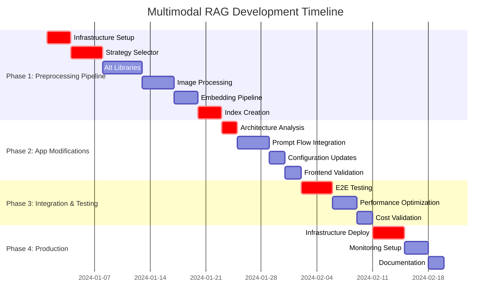

# Azure Multimodal RAG Production Development Plan
## Comprehensive Step-by-Step Implementation Strategy

---

## 📋 Executive Summary

This development plan focuses on two main development streams:

1. **Primary Strategy**: Build a **separate cost-effective preprocessing pipeline** using Python libraries (PyMuPDF, PDFPlumber, SentenceTransformers) to create Azure Search indexes 70-85% cheaper than Azure Document Intelligence Skills
2. **Secondary Strategy**: **Modify the existing app** to consume Azure Prompt Flow endpoints instead of direct AI Search/OpenAI calls

**Key Separation**: The preprocessing pipeline is completely separate from the app. The app will continue to consume Azure Search indexes (just cheaper ones) and optionally switch to Prompt Flow endpoints for orchestration.

---

## 🎯 Project Objectives

1. **Cost-Effective Index Creation**: Build preprocessing pipeline achieving 70-85% cost reduction vs Azure Document Intelligence
2. **App Prompt Flow Integration**: Modify existing app to consume Prompt Flow endpoints while preserving visual citations
3. **Visual Citation Preservation**: Maintain PDF highlighting and image citation capabilities through both strategies
4. **Production Readiness**: Enterprise-ready deployment for both preprocessing and app components
5. **Scalability**: Support enterprise document processing volumes with cost optimization

---

## 🏗️ Feature Breakdown & User Stories

### Feature 1: Cost-Effective Preprocessing Pipeline (Separate System)
**Epic**: Build standalone document processing system for cheaper index creation

#### User Stories:
- **As a** Content Manager **I want** a cost-effective document processing pipeline **so that** I can index large document collections at 70-85% lower cost
- **As a** DevOps Engineer **I want** automated preprocessing deployment **so that** I can process documents in batch efficiently
- **As a** Administrator **I want** processing cost visibility and strategy selection **so that** I can optimize costs per document type

### Feature 2: App Prompt Flow Integration (App Modifications)
**Epic**: Modify existing app to consume Prompt Flow endpoints while preserving functionality

#### User Stories:
- **As a** Business User **I want** improved response quality through Prompt Flow **so that** I get better, more contextual answers
- **As a** Research Analyst **I want** visual citations preserved with Prompt Flow **so that** I can continue to verify and trace information sources
- **As a** Administrator **I want** seamless transition to Prompt Flow **so that** users experience no disruption during migration

### Feature 3: Enhanced Document Processing Strategies (Preprocessing Enhancement)
**Epic**: Implement alternative processing libraries and strategies from PDF analysis

#### User Stories:
- **As a** Content Manager **I want** intelligent document strategy selection **so that** text-heavy documents use cheaper processing while image-heavy documents get optimal quality
- **As a** Business User **I want** consistent search quality **so that** cost optimization doesn't impact my ability to find information
- **As a** Administrator **I want** processing analytics **so that** I can track cost savings and quality metrics

### Feature 4: Production Infrastructure (Both Systems)
**Epic**: Deploy enterprise-ready infrastructure for preprocessing and app

#### User Stories:
- **As a** DevOps Engineer **I want** automated deployment pipelines **so that** I can deploy preprocessing and app updates consistently
- **As a** System Administrator **I want** monitoring and alerting **so that** I can ensure both systems operate reliably
- **As a** Finance Manager **I want** cost tracking across both systems **so that** I can measure ROI and optimize spending

---

## 📝 Detailed Implementation Tasks

### Phase 1: Cost-Effective Preprocessing Pipeline Development (Weeks 1-4)

#### Task 1.1: Preprocessing Infrastructure Setup
**Priority**: Critical | **Estimated Time**: 3 days

- [x] **Set up separate preprocessing environment**
  - [x] Create dedicated Azure resource group for preprocessing pipeline
  - [x] Set up Azure Container Instances or App Service for preprocessing jobs
  - [x] Configure Azure Blob Storage for document input/output
  - [x] Set up Azure Key Vault for preprocessing credentials
  - [ ] Create separate monitoring and logging for preprocessing

- [x] **Implement Python preprocessing foundation**
  - [x] Set up Python environment with required dependencies (PyMuPDF, PDFPlumber, SentenceTransformers)
  - [ ] Create containerized preprocessing application
  - [x] Implement basic document processing workflow
  - [x] Set up configuration management for processing strategies
  - [ ] Create preprocessing job queue system

#### Task 1.2: Document Strategy Selector Implementation
**Priority**: Critical | **Estimated Time**: 4 days

- [x] **Implement DocumentStrategySelector class (README Section 2.2)**
  - [x] Create document content analysis algorithms
  - [x] Implement image ratio and text density detection
  - [x] Configure strategy thresholds (text_only, text_optimized, image_heavy, balanced)
  - [ ] Add cost estimation per strategy
  - [ ] Implement strategy recommendation logging

- [x] **Create processing strategy implementations**
  - [x] Implement `text_only` strategy (PyMuPDF fast, skip images, local embeddings)
  - [x] Implement `text_optimized` strategy (basic layout, Mistral OCR, local embeddings)
  - [ ] Implement `image_heavy` strategy (full layout, hybrid Mistral+GPT-4o, Azure embeddings)
  - [ ] Implement `balanced` strategy (selective processing based on content)
  - [ ] Add strategy performance benchmarking

#### Task 1.3: Alternative Document Processing Libraries
**Priority**: High | **Estimated Time**: 5 days

- [x] **Implement PyMuPDF-based processing**
  - [x] Create text extraction with coordinate preservation
  - [x] Implement image extraction with metadata
  - [x] Add layout analysis for document structure
  - [x] Create bounding box extraction for visual citations
  - [x] Implement batch processing capabilities

- [x] **Implement PDFPlumber integration**
  - [x] Add specialized table extraction capabilities
  - [x] Implement precise text positioning
  - [x] Create structured data extraction for complex layouts
  - [x] Add table-to-text conversion with formatting preservation
  - [x] Implement text flow analysis

- [x] **Implement pymupdf4llm optimization**
  - [x] Add LLM-optimized markdown output
  - [x] Create structured content hierarchies
  - [x] Implement content chunking strategies
  - [x] Add metadata preservation through processing pipeline
  - [ ] Create quality validation for LLM consumption

#### Task 1.4: Image Processing Pipeline
**Priority**: High | **Estimated Time**: 4 days

- [ ] **Implement Mistral OCR integration**
  - [ ] Set up Mistral OCR API connections
  - [ ] Create cost-effective text extraction from images
  - [ ] Implement OCR accuracy validation
  - [ ] Add batch image processing
  - [ ] Create OCR result caching

- [ ] **Implement selective GPT-4o Vision**
  - [ ] Create image complexity assessment
  - [ ] Implement selective GPT-4o calls for complex visuals
  - [ ] Add visual description generation
  - [ ] Create quality scoring for visual descriptions
  - [ ] Implement cost optimization for visual processing

- [ ] **Create hybrid processing approach**
  - [ ] Combine Mistral OCR + GPT-4o Vision strategically
  - [ ] Implement quality vs cost optimization
  - [ ] Add processing decision logging
  - [ ] Create cost per image tracking
  - [ ] Implement processing result validation

#### Task 1.5: Embedding Generation Pipeline
**Priority**: Medium | **Estimated Time**: 3 days

- [x] **Implement local embedding options**
  - [x] Set up SentenceTransformers with all-MiniLM-L6-v2
  - [x] Create embedding generation for text content
  - [x] Implement embedding caching for cost optimization
  - [ ] Add embedding quality validation
  - [x] Create batch embedding processing

- [x] **Implement Azure OpenAI embedding fallback**
  - [x] Configure text-embedding-3-large for high-quality scenarios
  - [x] Configure text-embedding-3-small for cost-effective scenarios
  - [x] Implement embedding strategy selection based on content importance
  - [ ] Add token counting and cost tracking
  - [ ] Create embedding performance benchmarks

#### Task 1.6: Azure Search Index Creation
**Priority**: Critical | **Estimated Time**: 3 days

- [x] **Implement index creation pipeline**
  - [x] Create Azure Search index schema matching existing app requirements
  - [x] Implement document upload with proper field mappings
  - [x] Preserve locationMetadata structure for visual citations
  - [x] Add batch index updates for performance
  - [ ] Create index validation and quality checks

- [x] **Ensure citation compatibility**
  - [x] Maintain boundingPolygons format exactly as current system
  - [x] Preserve pageNumber and coordinate data
  - [x] Ensure ref_id generation matches app expectations
  - [ ] Test visual citation data flow end-to-end
  - [ ] Create citation accuracy validation

### Phase 2: App Modifications for Prompt Flow Integration (Weeks 5-7)

#### Task 2.1: Current App Architecture Analysis
**Priority**: Critical | **Estimated Time**: 2 days

- [ ] **Analyze existing app structure**
  - [ ] Map current AI Search integration points in backend
  - [ ] Identify OpenAI service calls in multimodalrag.py
  - [ ] Document current citation data flow
  - [ ] Analyze authentication and RBAC requirements
  - [ ] Create compatibility matrix for Prompt Flow transition

- [ ] **Plan Prompt Flow integration points**
  - [ ] Identify where app currently calls AI Search directly
  - [ ] Map where app calls OpenAI services directly
  - [ ] Plan Prompt Flow endpoint consumption strategy
  - [ ] Design backward compatibility approach
  - [ ] Create migration strategy for gradual rollout

#### Task 2.2: Prompt Flow Endpoint Integration
**Priority**: High | **Estimated Time**: 4 days

- [ ] **Modify backend for Prompt Flow consumption**
  - [ ] Update multimodalrag.py to call Prompt Flow endpoints instead of direct services
  - [ ] Implement Prompt Flow authentication and authorization
  - [ ] Create Prompt Flow response parsing to maintain current app response format
  - [ ] Add error handling and fallback to direct services
  - [ ] Implement Prompt Flow endpoint health checking

- [ ] **Preserve visual citation functionality**
  - [ ] Ensure Prompt Flow responses include citation metadata
  - [ ] Validate boundingPolygons and pageNumber preservation
  - [ ] Test visual citation rendering with Prompt Flow data
  - [ ] Create citation compatibility validation
  - [ ] Implement citation fallback mechanisms

#### Task 2.3: App Configuration Updates
**Priority**: Medium | **Estimated Time**: 2 days

- [ ] **Update app configuration**
  - [ ] Add Prompt Flow endpoint configuration
  - [ ] Create feature flags for Prompt Flow vs direct service calls
  - [ ] Update environment variable management
  - [ ] Configure Prompt Flow authentication
  - [ ] Add Prompt Flow monitoring and logging

- [ ] **Implement gradual migration**
  - [ ] Create A/B testing capability for Prompt Flow vs direct calls
  - [ ] Add user-based feature flagging
  - [ ] Implement rollback mechanisms
  - [ ] Create performance comparison logging
  - [ ] Add migration progress tracking

#### Task 2.4: Frontend Compatibility Validation
**Priority**: Medium | **Estimated Time**: 2 days

- [ ] **Validate frontend compatibility**
  - [ ] Test CitationViewer.tsx with Prompt Flow responses
  - [ ] Validate PdfHighlighter.tsx coordinate rendering
  - [ ] Test conversation history with Prompt Flow
  - [ ] Verify search result formatting
  - [ ] Ensure no frontend changes required

- [ ] **Performance optimization**
  - [ ] Implement response caching for Prompt Flow calls
  - [ ] Add request batching where possible
  - [ ] Optimize API call patterns
  - [ ] Add performance monitoring
  - [ ] Create performance comparison metrics

### Phase 3: Integration Testing & Optimization (Weeks 8-9)

#### Task 3.1: End-to-End Integration Testing
**Priority**: Critical | **Estimated Time**: 4 days

- [ ] **Test preprocessing to app pipeline**
  - [ ] Process documents through new preprocessing pipeline
  - [ ] Validate created indexes work with existing app
  - [ ] Test visual citations with preprocessed content
  - [ ] Verify search quality and relevance
  - [ ] Validate cost savings achieved

- [ ] **Test Prompt Flow integration**
  - [ ] Test app with Prompt Flow endpoints
  - [ ] Validate response quality and format
  - [ ] Test visual citation preservation
  - [ ] Verify conversation history functionality
  - [ ] Test error handling and fallbacks

#### Task 3.2: Performance Optimization
**Priority**: High | **Estimated Time**: 3 days

- [ ] **Optimize preprocessing performance**
  - [ ] Implement parallel document processing
  - [ ] Add processing queue optimization
  - [ ] Create processing time monitoring
  - [ ] Optimize memory usage for large documents
  - [ ] Add processing failure recovery

- [ ] **Optimize app Prompt Flow integration**
  - [ ] Optimize Prompt Flow call patterns
  - [ ] Implement response caching
  - [ ] Add connection pooling
  - [ ] Optimize authentication flows
  - [ ] Create performance dashboards

#### Task 3.3: Cost Analysis & Validation
**Priority**: High | **Estimated Time**: 2 days

- [ ] **Validate cost savings**
  - [ ] Measure actual preprocessing costs vs Azure Document Intelligence
  - [ ] Track Prompt Flow costs vs direct service calls
  - [ ] Create cost comparison reports
  - [ ] Validate 70-85% cost reduction target
  - [ ] Document cost optimization strategies

- [ ] **Quality validation**
  - [ ] Compare search quality between old and new indexes
  - [ ] Validate visual citation accuracy
  - [ ] Test response quality with Prompt Flow
  - [ ] Create quality metrics dashboard
  - [ ] Document quality vs cost trade-offs

### Phase 4: Production Deployment & Monitoring (Weeks 10-12)

#### Task 4.1: Production Infrastructure Setup
**Priority**: Critical | **Estimated Time**: 4 days

- [ ] **Deploy preprocessing pipeline to production**
  - [ ] Set up production preprocessing environment
  - [ ] Configure production document processing queues
  - [ ] Set up production monitoring and alerting
  - [ ] Create disaster recovery procedures
  - [ ] Implement production security policies

- [ ] **Deploy app with Prompt Flow integration**
  - [ ] Deploy app updates to production
  - [ ] Configure production Prompt Flow endpoints
  - [ ] Set up production monitoring
  - [ ] Create rollback procedures
  - [ ] Test production authentication flows

#### Task 4.2: Monitoring & Alerting
**Priority**: High | **Estimated Time**: 3 days

- [ ] **Implement comprehensive monitoring**
  - [ ] Create preprocessing pipeline monitoring
  - [ ] Add Prompt Flow integration monitoring
  - [ ] Set up cost tracking dashboards
  - [ ] Implement quality metrics tracking
  - [ ] Create alert notifications for failures

- [ ] **Create operational dashboards**
  - [ ] Build preprocessing cost and performance dashboard
  - [ ] Create app performance with Prompt Flow dashboard
  - [ ] Add visual citation accuracy tracking
  - [ ] Implement user experience monitoring
  - [ ] Create operational health overview

#### Task 4.3: Documentation & Training
**Priority**: Medium | **Estimated Time**: 2 days

- [ ] **Create operational documentation**
  - [ ] Document preprocessing pipeline operations
  - [ ] Create app Prompt Flow integration guide
  - [ ] Document troubleshooting procedures
  - [ ] Create cost optimization guides
  - [ ] Document monitoring and alerting

- [ ] **User training and adoption**
  - [ ] Create user guides for any new features
  - [ ] Document performance improvements
  - [ ] Create cost savings reports
  - [ ] Train operational staff
  - [ ] Create feedback collection mechanisms

---

## 🎯 Success Criteria & KPIs

### Preprocessing Pipeline KPIs
- [ ] **Cost Reduction**: 70-85% reduction in document processing costs vs Azure Document Intelligence
- [ ] **Processing Speed**: Process 100 documents per hour with quality validation
- [ ] **Quality Maintenance**: Visual citation accuracy > 95% with cheaper processing
- [ ] **Reliability**: 99% successful processing rate with error recovery
- [ ] **Scalability**: Handle 10,000+ documents with linear cost scaling

### App Integration KPIs
- [ ] **Response Quality**: Maintain or improve response quality with Prompt Flow
- [ ] **Performance**: Query response time < 3 seconds for 95% of requests
- [ ] **Visual Citations**: 100% preservation of visual citation functionality
- [ ] **Reliability**: 99.9% uptime with Prompt Flow integration
- [ ] **User Experience**: No degradation in user satisfaction during transition

### Business KPIs
- [ ] **Total Cost Optimization**: 60-80% reduction in overall operational costs
- [ ] **Processing Volume**: Support 5x increase in document processing volume
- [ ] **ROI Achievement**: Positive ROI within 3 months of deployment
- [ ] **User Adoption**: Seamless transition with < 1% user complaints
- [ ] **Operational Efficiency**: 50% reduction in manual document processing time

---

## 🚀 Implementation Timeline

---

## 📊 Risk Assessment & Mitigation

### High-Risk Items
1. **Visual Citation Compatibility**: Risk of breaking PDF highlighting with new preprocessing
   - **Mitigation**: Comprehensive citation testing and exact metadata format preservation
2. **Cost Savings Target**: Risk of not achieving 70-85% cost reduction
   - **Mitigation**: Incremental cost validation and strategy adjustment throughout development
3. **Prompt Flow Integration Complexity**: Risk of disrupting existing app functionality
   - **Mitigation**: Feature flags, gradual rollout, and comprehensive rollback procedures

### Medium-Risk Items
1. **Processing Quality Degradation**: Risk of lower quality with cheaper processing
   - **Mitigation**: Quality benchmarking and selective strategy application
2. **Performance Impact**: Risk of slower processing with new pipeline
   - **Mitigation**: Performance optimization and parallel processing implementation

---

## 🔄 Next Steps

1. **Review and approve this revised development plan**
2. **Set up separate environments for preprocessing pipeline and app modifications**
3. **Begin Phase 1: Preprocessing pipeline infrastructure setup**
4. **Establish cost tracking and quality benchmarking baselines**
5. **Prepare integration testing scenarios for both development streams**

---

*This plan separates the preprocessing pipeline development from app modifications, focusing on cost optimization through Python libraries while preserving the proven visual citation capabilities. The Prompt Flow integration enhances the existing app without requiring new flow development.* 